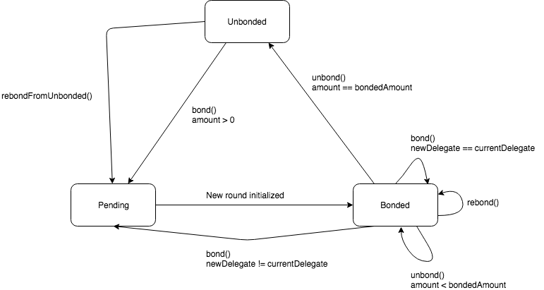

# Livepeer Technical Specification

## Table of Contents

* [Introduction](#introduction)
* [Users](#users)
* [Mechanics](#mechanics)
* [Smart Contract Design](#smart-contract-design)
* [Data Types](#data-types)
* [Faults](#faults)
* [Actions](#actions)
* [Parameters](#parameters)

## Introduction

The Livepeer protocol defines the rules of participation for a cryptotoken powered decentralized live video transcoding marketplace. The initial version of the protocol is implemented via a system of smart contracts
on the Ethereum blockchain.

This document is a technical specification of the protocol. For a more general overview of the protocol, see the [whitepaper](https://github.com/livepeer/wiki/blob/master/WHITEPAPER.md).

Given that the initial version of the protocol is implemented via a system of Ethereum smart contracts, the design of the protocol is necessarily influenced and restricted by the current capabilities of smart contracts
and the Ethereum blockchain. Consequently, this specification assumes smart contracts as the implementation tool and will describe protocol actions in terms of smart contract function calls that
trigger state transitions within the system.

## Users

Users that bond tokens have **bonded stake** that can be delegated to another user. The total amount of bonded tokens delegated to a user is the user's **delegated stake**.

The users that participate in the Livepeer protocol are:

- **Delegators**: Users that bond tokens and delegate their bonded stake to other users, usually registered transcoders in exchange for shared rewards and fees.
- **Transcoders**: Delegators that also perform transcoding work for the network. The transcoders with the most delegated stake are elected as active transcoders that process transcode jobs for the network.
- **Broadcasters**: Submit transcode jobs for live video streams.
- **Watchers**: Submit slash proofs as on-chain evidence of transcoder faults to penalize transcoders and to claim a finder's fee.

## Mechanics

The Livepeer protocol is round based and each round is represented by some number of Ethereum blocks. During each round, delegators help elect the top transcoders that share the most rewards and fees and the transcoders
that they believe will create the most economic value in the network by efficiently transcoding live video streams. They delegate their bonded stake to registered transcoders and at
the beginning of each round, the top transcoders with the largest amount of delegated stake amongst all registered transcoders are locked in as the members of the active transcoder set for that round.
Members of the active transcoder set earn inflationary rewards during a round in proportion to their delegated stake. The transcoder keeps a portion of the rewards and shares the rest with its delegators based on the reward cut rate previously advertised.

Broadcasters that seek to distribute live video to a large audience in a variety of bitrates and formats deposit Ether and submit transcode jobs which are psuedorandomly assigned to active transcoders
weighted by their delegated stake. Upon assignment, the broadcaster and the assigned transcoder establish a connection off-chain. Then, the broadcaster sends video segments to the transcoder who transcodes the input segments into
output segments for the transcoded video streams that correspond to each of the video profiles requested by the broadcaster. As segments are being transcoded, transcoders can submit a claim of work
for a range of segments. For each claim, certain segments are pseudorandomly challenged. For each challenged segment, a transcoder must submit a proof that verifies that the transcoder not only performed
the transcoding work described in its claim for the challenged segment, but also that the transcoding work was performed correctly. The protocol relies on external systems such as TrueBit and Oraclize
for the verification of transcoding work.

Transcoders that are discovered to be acting in a provably malicious manner are slashed - they lose a portion of their bonded stake and their position in the active transcoder set. If a transcoder acts honestly
and successfully passes verification for claims of work, it earns the fees associated with a transcode job. The transcoder keeps a portion of the fees and shares the rest with its delegators based on the fee share
rate previously advertised.

## Smart Contract Design

The Livepeer smart contract system is written in Solidity and will be deployed on the Ethereum blockchain. The system consists of the following contracts:

- `Controller`: Maintains a registry that maps contract identifiers to contract addresses.
- `LivepeerToken`: Manages state and logic for the ERC-20 Livepeer token that is used for bonding and paying transcode job fees. The owner can mint new tokens.
- `ManagerProxy`: A proxy contract that maintains state and relies on a target contract to implement state changing logic. It forwards function calls using `delegatecall`
to invoke function logic in a target contract with its own storage context.
- `ServiceRegistry`: Manages transcoder service metadata that is required for the off-chain transcoding workflow.
- `RoundsManager`: Manages state and logic associated with round progression.
- `BondingManager`: Manages state and logic associated with bonding, unbonding, transcoder registration, and claiming rewards and fees.
- `JobsManager`: Manages state and logic associated with the creation and assignment of transcode jobs as well as the claiming and verification of transcoding work.
- `Minter`: Manages state and logic associated with the issuance of new tokens.
- `Verifier`: Defines a generic interface for verification of transcoding work. A verifier contract can use a variety of implementations that can utilize external systems that perform
off-chain computation as long as the contract adheres to the `Verifier` interface. Below are a few verifier implementations that the protocol will support:
  - `LivepeerVerifier`: Maintains a whitelist of addresses associated with trusted solver nodes. When the contract receives a verification request, solver nodes perform the relevant transcoding computation
  for a segment and submit the result hash on-chain.
  - `OraclizeVerifier`: Integrates with the Oraclize off-chain computation service. When the contract receives a verification request, it sends a computation query to Oraclize. Then, Oraclize performs
  the relevant tarnscoding computation for a segment and submits the result hash on-chain.
  - `TrueBitVerifier`: Integrates with TrueBit's interactive verification game. When the contract receives a verification request, it sends a computation task to TrueBit which initiates the interactive
  verification game. Upon the completion of the verification game, the TrueBit solver's result hash is submitted on-chain. This implementation will not be included in the initial version of the protocol
  since TrueBit is not yet in production, but it will be included in a future protocol update.

Contracts registered with `Controller` are managers. Managers use the registry maintained by `Controller` to look up the addresses of other managers in the system.

`BondingManager`, `JobsManager`, and `RoundsManager` are deployed as upgradeable manager proxies. An instance of `ManagerProxy` is deployed for each of these managers and the actual
contracts are deployed as target contracts for the manager proxies. As a result, these managers can be upgraded by deploying new versions of the target contracts while maintaining
state (with some storage layout related restrictions).

After protocol genesis, `Minter` becomes the owner of `LivepeerToken` and is able to issue new tokens based on the logic in its implementation.

For any contract with the name `Contract` we refer to the deployed instance of the contract as `contract`.

Function calls on a specific contract are written as `contract.foo()`. Parameters are excluded when describing function calls and instead detailed in plain English.

The staking token of the protocol is the Livepeer token which will be referred to as LPT.

The payment token of the protocol is currently regular Ether, which will be referred to as ETH, but the protocol could be modified to support other tokens such as stablecoins in the future.

See the [developer documentation](#) for the full documentation of the contract API and descriptions of the contract functions described in this specification.

## Data Types

#### Transcode Job

Broadcasters create transcode jobs that are assigned to active transcoders in the network. The assigned transcoder is selected from the active transcoder set
during the round that the job is created.

| Field                  | Description                                                                                                                                        |
| ---------------------- | -------------------------------------------------------------------------------------------------------------------------------------------------- |
| **jobId**              | The unique identifier for the job.                                                                                                                 |
| **streamId**           | The stream identifier.                                                                                                                             |
| **transcodingOptions** | The concatenated list of video profile identifiers.                                                                                                |
| **maxPricePerSegment** | The maximum price per segment a broadcaster is willing to pay a transcoder per segment.                                                            |
| **broadcasterAddress** | The Ethereum address of the broadcaster.                                                                                                           |
| **transcoderAddress**  | The Ethereum address of the assigned transcoder.                                                                                                   |
| **creationRound**      | The round during which the job was created.                                                                                                        |
| **creationBlock**      | The block during which the job was created.                                                                                                        |
| **endBlock**           | The block at which a job is considered inactive.                                                                                                   |
| **claims**             | The transcode claims submitted for the job.                                                                                                        |
| **escrow**             | The amount of fees associated with transcode claims that are being held before the verification and slashing period for those claims are complete. |

#### Transcode Receipt

Transcoders store transcode receipts for each segment that they transcode.

| Field                  | Description                                                                                       |
| ---------------------- | ------------------------------------------------------------------------------------------------- |
| **streamId**           | The stream identifier.                                                                            |
| **segmentNumber**      | The segment's position in the sequential ordering of segments in the stream.                      |
| **dataHash**           | The Keccak-256 hash of the input segment data payload.                                            |
| **transcodedDataHash** | The Keccak-256 hash of the transcoded segment data payload.                                       |
| **broadcasterSig**     | The broadcaster's signature over the segment hash `keccak256(streamId, segmentNumber, dataHash)`. |

#### Transcode Claim

Transcoders submit transcode claims for ranges of segments that they want to claim work for. Some number of claimed segments are then later
challenged for verification. Each transcode claim is associated with a transcode job.

| Field                    | Description                                                                                   |
| ------------------------ | --------------------------------------------------------------------------------------------- |
| **claimId**              | The unique identifier for the claim.                                                          |
| **segmentRange**         | The start and end segment numbers (inclusive) of a range of segments to claim work for.       |
| **claimRoot**            | The Merkle root commitment of the transcode receipt hashes for the range of segments claimed. |
| **claimBlock**           | The block during which the claim was created.                                                 |
| **endVerificationBlock** | The block at which the verification period for the claim is complete.                         |
| **endSlashingBlock**     | The block at which the slashing period for the claim is complete.                             |
| **segmentVerifications** | The segments that have been submitted for verification.                                       |
| **status**               | The status of the claim (pending, slashed, complete)                                          |

The **claimRoot** is computed as follows:

Given segments `s_1, s_2,..., s_n`, the transcoder creates transcode receipts `r_1, r_2,..., r_n`. The transcoder computes the transcode receipt hashes
`keccak256(r_1), keccak256(r_2),..., keccak256(r_n)`. Then, the transcoder creates a Merkle tree using the transcode receipt hashes as the leaves of the tree. The
root of the Merkle tree is used as **claimRoot** in a transcode claim.

#### Transcode Proof

Transcoders submit transcode proofs for claimed segments that are challenged for verification.

| Field               | Description                                                                                                                              |
| ------------------- | ---------------------------------------------------------------------------------------------------------------------------------------- |
| **jobId**           | The transcode job identifier.                                                                                                            |
| **claimId**         | The transcode claim identifier.                                                                                                          |
| **segmentNumber**   | The segment's position in the sequential ordering of segments in the stream.                                                             |
| **dataStorageHash** | The content-addressed storage hash used to retrieve the segment data payload from a distributed storage network (used for verification). |
| **dataHashes**      | The Keccak-256 hash of the input segment data payload and the Keccak-256 hash of the transcoded segment data payload.                    |
| **broadcasterSig**  | The broadcaster's signature over the segment hash `keccak256(streamId, segmentNumber, dataHash)`.                                        |
| **receiptProof**    | The Merkle proof proving the transcode receipt was submitted with the Merkle root commitment contained in the transcode claim.           |

The corresponding transcode receipt hash for **receiptProof** can be computed as follows:

Let `jobs` be a mapping of job IDs to transcode jobs. The transcode receipt hash is `keccak256(jobs[jobId].streamId, segmentNumber, dataHashes[0], dataHashes[1], broadcasterSig)`.

#### Transcoder Pool

Registered transcoders are tracked in a transcoder pool structure with a max size of `numTranscoders` such that `numTranscoders >= numActiveTranscoders`. Each element in the pool structure
contains a transcoder's Ethereum address and the transcoder's delegated stake. The top `numActiveTranscoders` with the largest delegated stake in the transcoder pool at the beginning of a round
become the members of the active transcoder set for that round.

#### Delegator

Delegator information is stored in a delegator structure. All users that have bonded stake have a delegator structure associated with their address. As a result, users that are transcoders also have
delegator structures stored that contain their bonded stake information.

| Field                   | Description                                                           |
| ----------------------- | --------------------------------------------------------------------- |
| **bondedAmount**        | The amount of bonded stake.                                           |
| **fees**                | The amount of fees collected.                                         |
| **delegateAddress**     | The Ethereum address of the delegate.                                 |
| **delegatedAmount**     | The amount of delegated stake.                                        |
| **startRound**          | The round the delegator becomes bonded and delegated to its delegate. |
| **lastClaimRound**      | The last round that the delegator claimed reward and fee pool shares. |
| **nextUnbondingLockId** | The ID of the next unbonding lock the delegator creates.              |

A delegator can have zero or many unbonding locks. See [Unbonding Lock](#unbonding-lock) for more information.

A delegator can be in one of the following states `Pending`, `Bonded`, or `Unbonded`.
- A delegator is in the `Pending` state if `startRound > currentRound`. A delegator enters the `Pending` state when it bonds from the `Unbonded` state.
- A delegator is in the `Bonded` state if `startRound > 0 && startRound <= currentRound`. A delegator enters the `Bonded` state at the start of `startRound` which is set after it bonds.
- A delegator is in the `Unbonded` state if `bondedAmount == 0`. A delegator starts off in the `Unbonded` state by default
and also enters the `Unbonded` state if it fully unbonds.

#### Unbonding Lock

When a delegator unbonds, information about the amount of LPT being unbonded and the round at which the locked LPT can be withdrawn is stored in an unbonding lock structure. 

| Field             | Description                                                                          |
| ----------------- | ------------------------------------------------------------------------------------ |
| **amount**        | The amount of LPT being unbonded                                                     |
| **withdrawRound** | The round at which the unbonding period is over and the locked LPT can be withdrawn. |

#### Transcoder

Transcoder information is stored in a transcoder structure.

| Field                      | Description                                                                         |
| -------------------------- | ----------------------------------------------------------------------------------- |
| **lastRewardRound**        | The last round that the transcoder called received rewards as an active transcoder. |
| **rewardCut**              | The percentage of inflationary rewards that a transcoder keeps.                     |
| **feeShare**               | The percentage of transcode job fees that a transcoder shares with its delegators.  |
| **pricePerSegment**        | The price per segment charged for a stream.                                         |
| **pendingRewardCut**       | The pending reward cut for the next round a transcoder becomes active.              |
| **pendingFeeShare**        | The pending fee share for the next round a transcoder becomes active.               |
| **pendingPricePerSegment** | The pending price per segment for the next round a transcoder becomes active.       |
| **earningsPoolPerRound**   | The reward and fee pools for each round.                                            |

A transcoder can be in one of the following states `NotRegistered` or `Registered`.
- A transcoder is in the `NotRegistered` state if it is not a member of the registered transcoder pool.
- A transcoder is in the `Registered` state if it is a member of the registered transcoder pool such that it has non-zero bonded stake delegated towards itself.

#### Record

Transcoder service metadata required for the off-chain transcoding workflow is stored in a record structure.

| Field          | Description                                                                     |
| -------------- | ------------------------------------------------------------------------------- |
| **serviceURI** | The URI endpoint that can be used to send off-chain requests to the transcoder. |

## Faults

Cases of transcoders exhibiting malicious behavior are faults. These transcoder faults can be discovered either by watchers or by external verification systems. With faults discovered by
watchers, a watcher can submit a slash proof on-chain as evidence of a transcoder's malicious behavior. With faults discovered by an external verification system, a transcoder's malicious behavior can be detected by
an external verification system that submits the result of an off-chain computational task that can be compared with an on-chain commitment - any deviation from the commitment can be considered a fault that
the protocol can penalize.

Faults discovered by watchers include:

- **Missed verification**: The transcoder did not submit transcode proofs for challenged segments.
- **Double claiming segments**: The transcoder claimed a segment more than once.

Faults discovered by an external verification systems include:

- **Failed verification**: The transcoder failed verification for a challenged segment. We assume that external verification systems return correct results for computational tasks and that the
cryptoeconomic security properties of these systems provide a reasonable guarantee of correct computation. However, we recognize that the interaction with the external system is asynchronous meaning we cannot make any timing assumptions, so it is possible for the external system to fail to return a result in a timely manner for reasons such as network congestion which can hamper the discovery of failed verification faults.

## Actions

This section describes the state transitions associated with common protocol actions.

### Delegator State Transition Diagram

### Transcoder State Transition Diagram

Note: A transcoder must also be a delegator delegated to itself.

---

### Round Progression

#### *Requirements*

At the start of each round, the round must be initialized before any other protocol actions can be executed. Round initialization entails
locking in the latest active transcoder set for the round and setting the maximum number of tokens that can be issued (based on the current inflation rate) and redistributed (from a redistribution pool) during the round.
A round can only be initialized once and anybody can invoke the function to initialize a round.

#### *Initial State*

- `B` is the current block number such that `B % roundLength == 0`

#### *State Affected*

- `RoundsManager`
- `BondingManager`
- `Minter`

#### *Algorithm*

1. At some block number `M` in the set `B, B+1, B+2...B + roundLength - 1`, a user calls `roundsManager.initializeRound()`.
2. `currentRound = M / roundLength`.
3. If the last initialized round is not less than `currentRound`, abort.
3. Set the last initialized round to `currentRound`.
4. Take the first `numActiveTranscoders` transcoders from the transcoder pool and set them as the members of the active transcoder set for the round.
5. Set the maximum number of LPT that can be issued in the round based on the current LPT supply and the current `inflationRate`.
6. Set the maximum number of LPT that can be redistributed for the round based on the current redistribution pool and some constant number of rounds to spread the redistribution across.

#### *Notes*

Round progression is dependent on some actor calling `roundsManager.initializeRound()` at the start of a new round. Since, protocol actions cannot be executed until
the current round is initialized, actors have an incentive to pay the transaction fees for calling `roundsManager.initializeRound()` if they stand to economically benefit from
any protocol action that could take place during an initialized round. One example is a transcoder that has accumulated enough delegated stake to become an active transcoder in a round. The
transcoder will be able to claim inflationary rewards and fees from processing transcode jobs if it joins the active transcoder set for a round, so it has an incentive to initialize a round so that
it can be included in the active transcoder set for that round.

---

### Bonding

#### *Requirements*

Delegators bond LPT and delegate their bonded stake either to themselves or to someone else. Although delegators do not have to delegate to registered transcoders, they are incentivized to do so
by the potential returns in the inflationary rewards and fees shared by the transcoder. Delegators cannot bond more tokens than they own.

#### *Initial State*

- User `T`
- User `D` in the `Unbonded` state

#### *State Affected*

- `LivepeerToken`
- `BondingManager`

#### *Algorithm*

1. `D` approves `bondingManager` to transfer an amount of LPT from `D` by calling `livepeerToken.approve()`.
2. `D` calls `bondingManager.bond()` to bond `X` LPT to `T`.
3. If `D` is not in the `Unbonded` state, abort.
4. `T`'s delegated stake increases by `X`.
5. `D`'s LPT balance decreases by `X`.
6. `D` is delegated to `T`.
7. Set `startRound = currentRound + 1`.
8. `D` enters the `Pending` state.
9. Once `currentRound = startRound`, `D` enters the `Bonded` state.
10. The total bonded LPT increases by `X`.

---

### Changing Delegate

#### *Requirements*

Delegators that delegated their bonded stake to a transcoder can delegate their bonded stake to someone else. Reward and fee shares from past rounds will
automatically be claimed first - see [Automatically Claiming Rewards and Fees](#automatically-claiming-rewards-and-fees) for more details.

#### *Initial State*

- Users `T1`, `T2`
- User `D` delegated to `T1`
- User `D` in the `Bonded` state

#### *State Affected*

- `BondingManager`

#### *Algorithm*

1. `D` calls `bondingManager.bond()` to bond 0 LPT to `T2`.
2. `D`'s bonded stake `X` becomes delegated to `T2`.
3. `T2`'s delegated stake increases by `X`.
4. If `T2` is a transcoder, update `T2`'s position in the transcoder pool.
5. `T1`'s delegated stake decreases by `X`.
6. If `T1` is a transcoder, update `T1`'s position in the transcoder pool.

---

### Changing Delegate and Increasing Bonded Stake

#### *Requirements*

Delegators that delegated their bonded stake to someone can atomically delegate their bonded stake to someone else and also increase
their bonded stake. Reward and fee shares from past rounds will
automatically be claimed first - see [Automatically Claiming Rewards and Fees](#automatically-claiming-rewards-and-fees) for more details.

#### *Initial State*

- Users `T1` and `T2`
- User `D` is delegated to `T1`
- User `D` in the `Bonded` state

#### *State Affected*

- `LivepeerToken`
- `BondingManager`

#### *Algorithm*

1. `D` approves `bondingManager` to transfer `X2` LPT from `D` by calling `livepeerToken.approve()`.
2. `D` calls `bondingManager.bond()` to bond `X2` LPT to `T2`.
3. `D`'s bonded stake increases to `X1 + X2`.
4. `D`'s bonded stake `X1 + X2` becomes delegated to `T2`
5. `T2`'s delegated stake increases by `X1 + X2`.
6. If `T2` is a transcoder, update `T2`'s position in the transcoder pool.
7. `T1`'s delegated stake decreases by `X1`.
8. If `T1` is a transcoder, update `T1`'s position in the transcoder pool.
9. `D`'s LPT balance decreases by `X2`.

---

### Unbonding

#### *Requirements*

Delegators can unbond some or all of their bonded stake. When a delegator unbonds the LPT becomes locked in an unbonding lock. Locked LPT can be withdrawn after an unbonding period or rebonded at anytime. Reward and fee shares from past rounds will automatically be claimed first - see [Automatically Claiming Rewards and Fees](#automatically-claiming-rewards-and-fees) for more details.

#### *Initial State*

- User `D` is delegated to `T`
- User `D` in the `Bonded` state

#### *State Affected*

- `BondingManager`

#### *Algorithm*

1. `D` calls `bondingManager.unbond()` to unbond `X` from `T`.
2. If `D` is not in the `Bonded` state, abort.
3. If `X` is greater than `D`'s current bonded stake, abort.
4. Create an unbonding lock for `D` with the ID `nextUnbondingLockId`. Set `amount` to `X` and `withdrawRound` to `currentRound + unbondingPeriod`.
5. Increment `nextUnbondingLockId`.
6. `D`'s bonded stake decreases by `X`.
7. `T`'s delegated stake decreases by `X`.
8. The total bonded LPT decreases by `X`.
9. If `T` is a transcoder and `D != T` OR `D`'s bonded stake is non-zero, update `T`'s position in the transcoder pool.
10. If `D`'s bonded stake is zero, remove its delegate and start round. If `D` is a transcoder, remove `D` from the transcoder pool.

---

### Rebonding While Bonded

#### *Requirements*

Delegators can unbond some or all of their bonded stake and then rebond the LPT. The delegator does not have to wait for the unbonding period for locked LPT to complete before rebonding. If the delegator is in the `Bonded` state, locked LPT can only be rebonded to the delegator's current delegate. Reward and fee shares from past rounds will automatically be claimed first - see [Automatically Claiming Rewards and Fees](#automatically-claiming-rewards-and-fees) for more details.

#### *Initial State*

- User `D` is delegated to `T`
- User `D` in the `Bonded` state
- User `D` previously executed the `Unbonding` algorithm. Let the fields for the relevant unbonding lock for rebonding be `unbondingLockId`, `amount` and `withdrawRound`

#### *State Affected*

- `BondingManager`

#### *Algorithm*

1. `D` calls `bondingManager.rebond()`  with `unbondingLockId`.
2. If `D` is in the `Unbonded` state, abort.
3. If `unbondingLockId` is not a valid unbonding lock ID, abort.
4. `D`'s bonded stake increases by `amount`.
5. `T`'s delegated stake increases by `amount`.
6. The total bonded LPT increases by `amount`.
7. If `T` is a transcoder, update `T`'s position in the transcoder pool.
8. Delete the unbonding lock for `unbondingLockId`.

---

### Rebonding While Unbonded

#### *Requirements*

Delegators can unbond some or all of their bonded stake and then rebond the LPT. Delegators can be in the `Unbonded` state and rebond locked LPT to a delegate of their choice. Reward and fee shares from past rounds will automatically be claimed first - see [Automatically Claiming Rewards and Fees](#automatically-claiming-rewards-and-fees) for more details.

#### *Initial State*

- User `D` is in the `Unbonded` state
- User `D` previously executed the `Unbonding` algorithm. Let the fields for the relevent unbonding lock for rebonding be `unbondingLockId`, `amount` and `withdrawRound`

#### *State Affected*

- `BondingManager`

#### *Algorithm*

1. `D` calls `bondingManager.rebondFromUnbonded()` with the new delegate `T` and `unbondingLockId`.
2. If `D` is not in the `Unbonded` state, abort.
3. If `unbondingLockId` is not a valid unbonding lock ID, abort.
4. `D`'s start round is set to `currentRound + 1`.
5. `D`'s delegate is set to `T`.
6. `D`'s bonded stake increases by `amount`.
7. `D`'s delegated stake increases by `amount`.
8. The total bonded LPT increases by `amount`.
9. If `T` is a transcoder, update `T`'s position in the transcoder pool.
10. Delete the unbonding lock for `unbondingLockId`.

---

### Withdrawing Bonded Stake (LPT)

#### *Requirements*

Delegators with bonded stake can unbond to start the process of withdrawing their bonded LPT. Delegators cannot withdraw locked LPT until the unbonding period for the locked LPT is complete. Reward and fee shares from past rounds will automatically be claimed first - see [Automatically Claiming Rewards and Fees](#automatically-claiming-rewards-and-fees) for more details.

#### *Initial State*

- User `D` previously executed the `Unbonding` algorithm. Let the fields for the relevent unbonding lock for rebonding be `unbondingLockId`, `amount` and `withdrawRound`
- The protocol progressed through `unbondingPeriod` number of rounds such that the current round is `withdrawRound`.

#### *State Affected*

- `LivepeerToken`
- `BondingManager`

#### *Algorithm*

1. `D` calls `bondingManager.withdrawStake()` with `unbondingLockId`.
2. If `unbondingLockId` is not a valid unbonding lock ID, abort.
3. If `withdrawRound > currentRound`, abort.
4. `D`'s LPT balance increases by `amount`.
5. Delete the unbonding lock for `unbondingLockId`.

---

### Withdrawing Fees (ETH)

#### *Requirements*

Delegators can withdraw any collected fees at any time. Reward and fee shares from past rounds will
automatically be claimed first - see [Automatically Claiming Rewards and Fees](#automatically-claiming-rewards-and-fees) for more details.

#### *State Affected*

- `BondingManager`

#### *Initial State*

- User `D`

#### *Algorithm*

1. `D` calls `bondingManager.withdrawFees()` to withdraw `X` ETH.
2. `D`'s collected fees decreases by `X`.
3. `D`'s ETH balance increases by `X`.

---

### Transcoder Registration

#### Requirements

A user can register as a transcoder and set the rates `rewardCut`, `feeShare` and `pricePerSegment`. A user cannot register as a transcoder unless it has a non-zero amount
of delegated stake. A user cannot register as a transcoder during the lock period of a round. If the transcoder pool is full and the user has more delegated stake than the transcoder
in the transcoder pool with the least delegated stake, the user successfully registers as a transcoder and evicts the other transcoder from the pool.

#### Initial State

- User `T` in the `NotRegistered` state

#### State Affected

- `BondingManager`

#### Algorithm

1. `T` calls `bondingManager.transcoder()` with percentage values for `rewardCut`, `feeShare` and `pricePerSegment`.
2. If `T` has zero bonded stake delegated towards itself, abort.
3. Set the rates for `T` as a transcoder.
4. If the transcoder pool is full and `T`'s delegated stake is greater than that of the transcoder with the least delegated stake, evict the latter and add the former to the transcoder pool thereby transitioning `T` into the `Registered` state

---

### Transcoder Service URI Update

#### Requirements

A transcoder can update its service URI in the `ServiceRegistry` to be used in the off-chain transcoding workflow.

#### Initial State

- User `T`

#### State Affected

- `ServiceRegistry`

#### Algorithm

1. `T` calls `serviceRegistry.setServiceURI()` with a provided `serviceURI`.
2. `T`'s service URI in `ServiceRegistry` is set to `serviceURI`.

---

### Transcoder Rates Update

#### *Requirements*

A transcoder can change its rates during a round. A transcoder cannot change its rates upwards during the lock period of a round, but it can adjust its price/segment downwards towards the lowest candidate offered price/segment during the lock period of a round.

#### *Initial State*

- Transcoder `T` in the `Registered` state

#### *State Affected*

- `BondingManager`

#### *Algorithm*

1. `T` calls `bondingManager.transcoder()` with percentage values for `rewardCut`, `feeShare` and `pricePerSegment`.
2. If the protocol is in the lock period of the round, and the transcoder is attempting any change other than downwardly adjusting price/segment, abort.
3. Set the rates for `T` as a transcoder.

---

### Rewards

#### *Requirements*

LPT rewards are distributed every round to the members of the active transcoder set for the round. The total rewards available for a round is a combination of newly issued LPT and redistributed LPT.
The amount of issued LPT during a round cannot exceed the maximum amount of LPT to be issued for a round which is set at the start of a round. The amount of redistributed LPT during a round
cannot exceed the maximum amount of LPT to be redistributed for a round which is set at the start of a round. An active transcoder's share of the rewards is based on the transcoder's proportional
delegated stake within the active transcoder set.

#### *Initial State*

- Total delegated stake of the active transcoder set is `X`
- Active transcoder `T` has `Y` delegated stake
- Maximum amount of LPT to be issued in round `N` is `A`.
- Maximum amount of LPT to be redistributed in round `N` is `B`.

#### *State Affected*

- `BondingManager`
- `Minter`
- `LivepeerToken`

#### *Algorithm*

1. `T` calls `bondingManager.reward()` in round `N`.
2. `(A * Y) / X` new LPT is issued.
3. Total supply of LPT increased by `(A * Y) / X`.
3. `T`'s rewards are computed as `rewards = ((A * Y) / Z) + ((B * Y) / Z)`.
4. Increase amount of LPT already issued in round `N` by `(A * Y) / Z`.
5. Increase the amount of LPT already redistributed in round `N` by `(B * Y) / Z`.
5. `T` credits its own bonded stake with `rewardCut` percent of `rewards`.
6. `T` places the rest of `rewards` in its reward pool for round `N`.

#### *Notes*

A delegator is not credited with its reward shares until it explicitly claims them. Thus, the total reward shares to be claimed added to a delegator's bonded stake is the
delegator's `pendingStake`. If a delegator has claimed all of its reward shares, its bonded stake will be equal to its `pendingStake`.

---

### Broadcaster Deposits

#### *Requirements*

A broadcaster deposits ETH which is used to pay transcoders.

#### *Initial State*

- Broadcaster `B`

#### *State Affected*

- `JobsManager`

#### *Algorithm*

1. `B` calls `jobsManager.deposit()` to deposit `X` ETH.
2. `B`'s ETH balance decreases by `X`.
3. `B`'s on-chain deposit increases by `X`.

---

### Broadcaster Withdrawals

#### *Requirements*

A broadcaster withdraws ETH from its deposit. A broadcaster cannot withdraw if it has any active transcode jobs.

#### *Initial State*

- Broadcaster `B`

#### *State Affected*

- `JobsManager`

#### *Algorithm*

1. `B` calls `jobsManager.withdraw()` to withdraw `X` ETH.
2. If `B` has an active transcode job, abort.
3. `B`'s ETH balance increases by `X`.
4. `B`'s on-chain deposit decreases by `X`.

---

### Job Creation & Assignment

#### *Requirements*

A broadcaster creates a transcode job on-chain which is pseudorandomly assigned to an active transcoder based on the transcoder's proportional delegated stake relative to the rest of the active transcoders during the current round.

#### *Initial State*

- Broadcaster `B`
- Active transcoder `T`

#### *State Affected*

- `JobsManager`

#### *Algorithm*

1. `B` calls `jobsManager.job()` to create a transcode job in round `N` and in block `M`.
2. Block `M` is mined. `block.blockhash(M)` is used as the seed for pseudorandomly assigning an active transcoder
3. An event is fired alerting all users that a new job has been created
4. Any user can call `bondingManager.electActiveTranscoder()` with the max price per segment of the job, the hash of the block the job was created in and the round the job was created to determine the transcoder assigned to the new job.
5. `T` is assigned the job and within the 256 blocks after the job creation, submits its first transcode claim to explicity set itself as the assigned transcoder for the job.

#### *Notes*

A transcoder can launch a *self-dealing attack* by acting as a broadcaster and attempting to assign itself a job. If a transcoder is also an Ethereum miner, it can try to manipulate the block hash of the
job creation block which is used as a random seed for assigning an active transcoder.

---

### Claiming and Verifying Work

#### *Requirements*

A transcoder that is assigned to a job submits transcode claims for segments that it has transcoded.

#### *Initial State*

- Transcoder `T` assigned to a job

#### *Algorithm*

1. `T` calls `jobsManager.claimWork()` to submit a transcode claim for a job with a range of segments claimed, and a Merkle root of transcode receipt hashes
corresponding to the range of segments claimed. The claim is created in block `M`.
2. Blocks `M` and `M + 1` are mined
3. A claimed segment with segment number `segmentNumber` is challenged if `uint256(keccak256(M + 1, block.blockhash(M + 1), segmentNumber)) % verificationRate == 0`.
4. Before block `M + verificationPeriod`, `T` calls `jobsManager.verify()` to submit a transcode proof for a challenged segment.
5. If `Verifier` submits a result hash on-chain that does not match the transcoded data hash submitted by `T`, `T` loses `failedVerificationSlashAmount` percent of its bonded stake and abort
6. Blocks are mined up through `M + slashingPeriod`.
7. `T` calls `jobsManager.distributeFees()` with the job ID and the claim ID.
8. `T` places `feeShare` percent of the fees into the fee pool for the job creation round.
9. `T` credits its own bonded stake with the rest of the fees.

#### *Notes*

A delegator is not credited with its fee shares until it explicitly claims them. Thus, the total fee shares to be claimed added to a delegator's collected fees is the
delegator's `pendingFees`. If a delegator has claimed all of its fee shares, its collected fees will be equal to its `pendingFees`.

A broadcaster can try to launch a *griefing attack* on a transcoder by sending segments with non-consecutive sequence numbers which forces a transcoder to call `jobsManager.claimWork()` multiple for discontinuous ranges of segments thereby
increasing the amount of transaction costs paid by the transcoder. As a defense, a transcoder can choose not to transcode segments if it observes that a broadcaster is consistently sending it segments with non-consecutive
sequence numbers and the increased transaction costs of multiple `jobsManager.claimWork()` calls outweighs the fees the transcoder could collect by claiming and verifying transcoded segments. A future protocol update could include
a better transode claim encoding such that transcoders are able to call `jobsManager.claimWork()` once for a discontinuous range of segments.

A transcoder can try to launch a *double claim segment attack* by submitting multiple transcode claims that include the same segment which would allow a transcoder to claim additional fees for the same amount
of transcoding work. As a defense, watchers can submit slash proofs that prove a transcoder submitted two transcode claims that include the same segment.

If a transcoder is also an Ethereum miner, it can try to launch a *useless transcoding attack* on a broadcaster by trying to manipulate the random seed used to compute challenged claimed segments. If the transcoder knows
the random seed before it calls `jobsManager.claimWork()`, it can selectively transcode the segments it knows will be challenged and output invalid output for the rest of the segments. As a result, the transcoder would be able to
successfully pass verification for the challenged segments without honestly transcoding the segments that were not challenged. Currently, the random seed used for computing challenged claimed segments is the block hash of the block after the transcode claim block. In this case, the transcoder must commit to the claimed segments and then try to manipulate the following block hash.

A transcoder can try to submit a transcode proof for a challenged segment at the end of the verification period and claim fees before the verifier submits the result of the
off-chain transcoding computation on-chain. A transcoder does not stand to economically benefit from doing this because it can still be slashed after the verification period finishes if the verifier
submits a transcoded data hash that does not match the transcoded data hash included in the transcode proof.

---

### Claiming Rewards & Fees

#### *Requirements*

Delegators that delegate their bonded stake to an active transcoder are entitled to a portion of the rewards and fees that the transcoder earns during a round. The reward and fee portions shared
by the transcoder to its delegators are based on the `rewardCut` and `feeShare` rates set by a transcoder. When a transcoder earns rewards during a round, it places the LPT in a reward pool associated
with the round. When a transcoder earns fees for a transcode job, it places the LPT in a fee pool associated with the round during which the transcode job was created.
The delegator reward share for a round is split amongst delegators that were delegated to the transcoder during the round based on a delegator's proportional bonded stake relative to the transcoder's delegated
stake. The delegator fee share for a round is split amongst delegators that were delegated to the transcoder during the round a transcode job was created based
on a delegator's proportional bonded stake relative to the transcoder's delegated stake.

#### *Initial State*

- Transcoder `T` with `X` delegated stake
- `Delegator `D` with `Y` bonded stake delegated to `T`

#### *State Affected*

- `BondingManager`

#### *Algorithm*

1. `T` earns `R` rewards and `F` fees for a transcode job created in round `N`.
2. `T` allocates `delegatorsRewards = (R * (100 - rewardCut)) / 100` rewards for its delegators and `delegatorsFees = (F * feeShare) / 100` for its delegators.
3. `D` claims reward and fees for round `N` either automatically or manually.
2. `D` credits `(delegatorsRewards * X) / Y` rewards into its bonded stake.
3. `D` credits `(delegatorsFees * X) / Y` fees into its unbonded stake.

#### *Notes*

See [Automatically Claiming Rewards and Fees](#automatically-claiming-rewards-and-fees) and [Manually Claiming Rewards and Fees](#manually-claiming-rewards-and-fees) for details on different approaches to
claiming rewards and fees for particular rounds.

---

### Automatically Claiming Rewards and Fees

#### *Requirements*

When a delegator calls a bonding related function (ex. delegates to a new transcoder), it first automatically claims its LPT share from the reward and fee pools for each round that it was delegated to its current transcoder.

#### *Initial State*

- Delegator `D`
- Transcoder `T`

#### *State Affected*

- `BondingManager`

#### *Algorithm*

1. `D` calls a bonding related function such as `bondingManager.bond()` or `bondingManager.unbond()`.
2. Before the logic of the bonding related function is executed, `D` claims rewards and fees for each round it was delegated to its current delegate through the current round.
3. After claiming rewards and fees through the current round, `D` sets its last claim round as the current round.
4. Execute the logic of the bonding related function.

#### *Notes*

If a delegator does not invoke a bonding related functions for a large number of rounds, it is possible that the number of rounds that it would need to automatically claim rewards and fees for becomes too large such
that the bonding related function cannot be executed within the Ethereum block gas limit. A restriction is imposed such that a delegator cannot claim through more rounds than
`maxEarningsClaimsRounds`. In this situation, a delegator can manually claim rewards and fees through a chosen end round.

---

### Manually Claiming Rewards and Fees

#### *Requirements*

Delegators can automatically claim rewards and fees when calling bonding related functions, but they need to be able to manually claim rewards and fees as well. A delegator can claim rewards and fees from its
last claim round through a chosen end round which does not necessarily have to be the current round.

#### *Initial State*

- Delegator `D`
- Transcoder `T`

#### *State Affected*

- `BondingManager`

#### *Algorithm*

1. `D` calls `bondingManager.claimEarnings()` with the end round through which to claim rewards and fees.
2. `D` claims rewards and fees for each it was delegated to its current delegate through the end round.
3. `D` sets its last claim round as the chosen end round.

#### *Notes*

A client interacting with the protocol can check how many rounds a delegator would have to claim rewards and fees for before calling a bonding related function. If the number of rounds is too large,
the client can divide the number of rounds into portions and make multiple calls to `bondingManager.claimEarnings()` with the end rounds corresponding to each portion. After claiming all the rewards
and fees, the client can then call the bonding related function without the risk of a function call not being executable within the Ethereum block gas limit. A restriction is imposed such that
a delegator cannot claim through more rounds than `maxEarningsClaimsRounds`.

---

### Submitting Slash Proofs

#### *Requirements*

A watcher can submit slash proofs as on-chain evidence that a transcoder faulted. The transcoder loses some percentage of its bonded stake depending on the type of fault. A portion of the penalty is awarded
to the watcher as a finder's fee. A watcher cannot slash a transcoder more than once for the same fault. Slashed funds are burned.

#### *Initial State*

- Broadcaster `B`
- Transcoder `T`
- Watcher `W`

#### *State Affected*

- `JobsManager`
- `BondingManager`

#### *Algorithm*

1. If `T` did not submit a transcode proof for a challenged segment, `W` calls `jobsManager.missedVerificationSlash()` with the transcode job ID, transcode claim ID and the segment number that is missing
a transcode proof.
2. If `T` submitted two transcode claims that include the same segment, `W` calls `jobsManager.doubleClaimSegmentSlash()` with the transcode job ID, the IDs of the two transcode claims with the same segment and
the segment number that was claimed twice.
3. `B` is refunded with all fees that are in escrow for the transcode job.
4. If `T` did not submit a transcode proof for a challenged segment, `T` loses `missedVerificationSlashAmount` percent of its bonded stake.
5. If `T` submitted two transcode claims that include the same segment, `T` loses `doubleClaimSegmentSlashAmount` percent of its bonded stake.
6. `T` is removed from the transcode pool.

---

### Manager Proxy Upgrades

#### *Requirements*

The only user that is able to upgrade a manager is the owner of `Controller`. Upgrading a manager proxy entails deploying a new version of the target contract that the manager proxy
depends on. The new version of the target contract can contain arbitrary changes in the business logic of the old version of the target contract. The new version of the target contract should
not change the storage layout of the old version of the target contract, meaning the definition order of existing storage variables should not change and existing storage variables should not be
removed or replaced. However, the names of existing storage variables can be changed and new storage variables can be added in the new version of the target contract.

#### *Initial State*

- `proxyName` is the name of the manager proxy being upgraded
- `proxyId` is the contract ID of the manager proxy, defined as `keccak256(proxyName)`
- `targetName` is the name of the target contract, conventionally defined as `proxyName + "Target"`
- `targetId` is the contract ID of the target contract, defined as `keccak256(targetName)`
- `newTargetAddr` is the address of the new version of the target contract

#### *State Affected*

- `Controller`

#### *Algorithm*

1. `controller`'s owner calls `controller.setContract(targetId, newTargetAddr)`
2. `controller` sets the contract address mapped to `targetId` as `newTargetAddr`
3. The manager proxy with ID `proxyId` uses `delegatecall` to forward function calls to the target contract with ID `targetId` and address `newTargetAddr`.

---

### Updating Parameters

#### *Requirements*

The only user that is able to update a manager's parameter values is the owner of `Controller`.

#### *Initial State*

- `paramName` is the name of the parameter being updated
- `newValue` is the new value for the parameter `paramName`

#### *State Affected*

- The manager

#### *Algorithm*

1. `controller`'s owner calls the parameter setter function defined in `manager` for `paramName`. For example, if `paramName == "unbondingPeriod"`, the function call is `manager.setUnbondingPeriod(newValue)`.
2. `manager` sets the value for `paramName` as `newValue`
3. `manager` fires an event notifying clients of the parameter update.

---

### Inflation Adjustment

#### *Requirements*

`inflation` automatically adjusts based upon the current bonding rate (the total amount of bonded stake in the network relative to the total supply of LPT) and `targetBondingRate`.
If the current bonding rate is below `targetBondingRate`, `inflation` should increase. The desired effect of an increase in `inflation` is for more users to participate in the
bonding and delegation process in order to increase the economic security of the network. Users that bond will be able to capture a larger share of the network relative to users that do
not bond by claiming a share of the inflationary rewards every round. Users that do not bond will see their LPT holdings become diluted in value due to the increase in the supply of LPT.
If the current bonding rate is above `targetBondingRate` `inflation` should decrease. The desired effect of a decrease in `inflation` is for less users to participate in the
bonding and delegation process in order to increase the amount of liquid LPT available in the network. Since the inflationary rewards are smaller, users might prefer to hold on to
liquid unbonded LPT which can be freely transacted and traded rather than bonding which locks up the LPT for a period of time. If the current bonding rate is equal to `targetBondingRate`,
`inflation` is unchanged.

#### *Initial State*

- Transcoder `T`
- Delegator `D`

#### *State Affected*

- `BondingManager`
- `RoundsManager`
- `Minter`

#### *Algorithm*

1. The current bonding rate increases via a call to a bonding related function in `BondingManager`.
2. A new round begins and someone calls `roundsManager.initializeRound()` to initialize the round.
3. If the current bonding rate is less than `targetBondingRate`, increase `inflation` by `inflationChange`.
4. If the current bonding rate is greater than `targetBondingRate`, decrease `inflation` by `inflationChange`.
5. If the current bonding rate is equal to `targetBondingRate`, keep `inflation` the same.

## Parameters

The protocol uses a number of parameters the values of which are used in protocol actions. In initial development phases after genesis, the values of these parameters can
be changed by the `Controller`'s owner which will be a multisig contract. In later development phases, the values of these parameters will only be changed by governance.

Each of the parameters are defined in the manager that they are the most relevant for.

### RoundsManager

| Parameter         | Description                                                                                                                                                        | Example Value |
| ----------------- | ------------------------------------------------------------------------------------------------------------------------------------------------------------------ | ------------- |
| `roundLength`     | Number of blocks in a round.                                                                                                                                       | 5760          |
| `roundLockAmount` | Percentage of blocks in a round that are a part of the lock period during which transcoders cannot change their rates upwards, or enter/leave the transcoder pool. | 10            |

### BondingManager

| Parameter                 | Description                                                                                                    | Example Value |
| ------------------------- | -------------------------------------------------------------------------------------------------------------- | ------------- |
| `unbondingPeriod`         | Number of rounds that a delegator must wait after calling `unbond` before it can withdraw its unbonded LPT.    | 7             |
| `numTranscoders`          | Maximum number of registered transcoders.                                                                      | 20            |
| `numActiveTranscoders`    | Maximum number of active transcoders during a round.                                                           | 10            |
| `maxEarningsClaimsRounds` | Maximum number of past rounds that a delegator can claim reward and fee shares through in a single transaction | 20            |

### JobsManager

| Parameter                       | Description                                                                                                                        | Example Value |
| ------------------------------- | ---------------------------------------------------------------------------------------------------------------------------------- | ------------- |
| `verificationRate`              | Percentage of segments in a transcode claim that will be challenged for verification.                                              | 5             |
| `verificationPeriod`            | Number of blocks after submitting a transcode claim during which a transcoder can submit transcode proofs for challenged segments. | 100           |
| `slashingPeriod`                | Number of blocks after `verificationPeriod` during which a watcher can submit a slash proof to penalize a transcoder for a fault.  | 100           |
| `failedVerificationSlashAmount` | Percentage of a transcoder's bonded stake that is slashed for a failed verification fault.                                         | 5             |
| `missedVerificationSlashAmount` | Percentage of a transcoder's bonded stake that is slashed for a missed verification fault.                                         | 20            |
| `doubleClaimSegmentSlashAmount` | Percentage of a transcoder's bonded stake that is slashed for a double claim segment fault.                                        | 30            |
| `finderFee`                     | Percentage of the slashed amount that is awarded to a watcher for submitting a valid slash proof.                                  | 5             |

### Minter

| Parameter           | Description                                                                                                  | Example Value |
| ------------------- | ------------------------------------------------------------------------------------------------------------ | ------------- |
| `inflation`         | Percentage of total LPT supply that is issued as new LPT during a round.                                     | 7             |
| `inflationChange`   | Percentage change in inflation that occurs when the current bonding rate does not equal `targetBondingRate`. | .02           |
| `targetBondingRate` | Percentage of total LPT supply that should be bonded to provid economic security for the system.             | 50            |

### Verifier

| Parameter              | Description                                                                                        | Example Value                                  |
| ---------------------- | -------------------------------------------------------------------------------------------------- | ---------------------------------------------- |
| `verificationCodeHash` | The content-addressed storage hash used to retrieve the code for verification of transcoding work. | QmZmvi1BaYSdxM1Tgwhi2mURabh46xCkzuH9PWeAkAZZGc |
