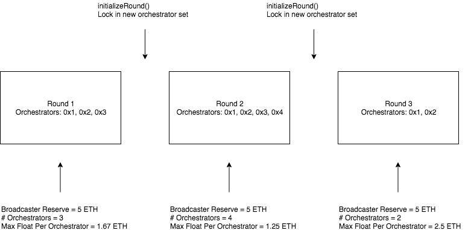
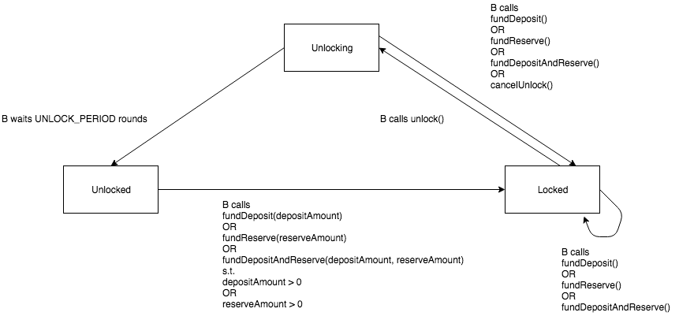

# Probabilistic Micropayments

## Introduction 

In the Streamflow release of the Livepeer protocol, broadcasters use a probabilistic micropayment protocol in order to pay for transcoding work done by orchestrators. Broadcasters send lottery tickets to orchestrators off-chain with video segments that need to be transcoded and orchestrators redeem winning lottery tickets on-chain in order to claim payments. Regardless of whether a ticket wins or not, an orchestrator accepts a ticket as a payment of the expected value of the ticket which is calculated from the ticket's face value and winning probability. While not every ticket is going to win, in the long run after receiving many tickets, orchestrators will be paid correctly and fairly due to the [law of large numbers](https://en.wikipedia.org/wiki/Law_of_large_numbers).

The probabilistic micropayment protocol consists of:

- A `TicketBroker` Ethereum smart contract that holds funds and processes winning tickets
- An off-chain protocol between a broadcasters and orchestrators for creating and sending tickets

This specification will describe both the `TicketBroker` contract and the off-chain protocol between broadcasters and orchestrators.

## Data Structures 

### Ticket

A `Ticket` represents a payment from a broadcaster to an orchestrator for transcoding work. Tickets are sent to orchestrators off-chain and winning tickets are redeemed on-chain with the `TicketBroker` contract.

| Field                 | Type    | Description                                                                                                  |
| --------------------- | ------- | ------------------------------------------------------------------------------------------------------------ |
| **recipient**         | address | The ETH address of the orchestrator                                                                          |
| **sender**            | address | The ETH address of the broadcaster                                                                           |
| **faceValue**         | uint256 | The face value of the ticket which is paid to `recipient` if the ticket wins                                 |
| **winProb**           | uint256 | The probability that a ticket will win represented as `winProb / (2^256 - 1)`                                |
| **senderNonce**       | uint256 | A monotonically increasing counter that makes a ticket unique for a `recipientRandHash` value                |
| **recipientRandHash** | bytes32 | The orchestrator's commitment to `recipientRand` represented as `keccak256(abi.encodePacked(recipientRand))` |
| **creationRound**     | uint256 | The last initialized round during which the ticket was created                                                                |
| **creationRoundHash** | bytes32 | The Ethereum block hash corresponding to `creationRound`                                                     |

The hash for a ticket `T` is computed as:

```
bytes32 ticketHash = keccak256(abi.encodePacked(
    T.recipient,
    T.sender,
    T.faceValue,
    T.winProb,
    T.senderNonce,
    T.recipientRandHash,
    T.creationRound,
    T.creationRoundHash
))
```

`winProb` can be a value from 0 to `2^256 - 1`. 

`recipientRand` is a random value generated by the orchestrator. Prior to sending tickets to an orchestrator, a broadcaster will request `recipientRandHash` from the orchestrator so that it can be included in tickets. Whenever an orchestrator reveals `recipientRand` (i.e. when the orchestrator redeems a winning ticket on-chain), the orchestrator must generate a new `recipientRand` and provide the corresponding `recipientRandHash` to broadcasters in order to ensure that broadcasters have no knowledge of `recipientRand` when creating tickets.

A broadcaster needs to produce an unpredictable value that can be combined with `recipientRand` in order to create a random value that neither the broadcaster nor the orchestrator can bias. In this specification we choose to use the broadcaster's signature `senderSig` over the ticket hash as the unpredictable value and in order to ensure that each ticket hash is unique we let `senderNonce` be a monotonically increasing counter that is reset whenever a new `recipientRandHash` value is used for a ticket.

The pay out from a winning ticket should compensate not only the receiving orchestrator, but also the orchestrator's delegators that staked toward the orchestrator when the ticket was sent to the orchestrator. The `TicketBroker` contract can send the face value of winning tickets to the orchestrator's fee pool for `creationRound` such that the orchestrator's delegators during `creationRound` can claim their share of the fees. `creationRound` is also used to determine the expiration round for a ticket. Since `TicketBroker` enforces a specific ticket validity period based off of a ticket's `creationRound`, broadcasters that create tickets with `creationRound` less than the current round will effectively reduce the ticket's validity period. Thus, while broadcasters can create tickets with `creationRound` set to a past round, orchestrators will likely reject such tickets due to their shorter effective validity period which means less time for the orchestrators to redeem winning tickets. 

The ticket also includes `creationRoundHash` in order to prevent a broadcaster from creating tickets that specify a creation round in the future. This specification assumes that the broadcaster, orchestrator and `TicketBroker` have access to a `RoundsManager` contract that stores an Ethereum block hash for each new round. Since the Ethereum block hash for a round is only stored when the round is initialized, a broadcaster would be unable to set `creationRound` to a future round unless it is able to predict the Ethereum block hash that will be stored when the future round is initialized.

Given a ticket `T`, a broadcaster will sign the ticket hash to produce `senderSig`. Then, a broadcaster will send both `T` and `senderSig` to an orchestrator.

### Reserve

A `Reserve` represents locked on-chain funds that are separate from a broadcaster's deposit. Unlike deposit funds which can be used to pay for an arbitrary amount of winning tickets sent to any orchestrator, reserve funds are split into equal allocations, each of which is committed to one of the registered orchestrators in the current round. A registered orchestrator is guaranteed the allocation value even if the broadcaster overspends such that its deposit is insufficient to pay for outstanding winning tickets. At this point, any winning ticket redemptions would claim from the broadcaster's reserve up to the value of the allocation. As rounds progress, a broadcaster's reserve is automatically committed to the registered orchestrators for the current round without any intervention by the broadcaster. 

The allocation value is also the maximum amount that a registered orchestrator will be willing to "float" for a broadcaster. When an orchestrator receives a winning ticket it treats the ticket face value as float since the broadcaster may or may not have sufficient deposit funds to cover the ticket face value at the time of redemption. An orchestrator can safely receive winning tickets and add to its float for a broadcaster up to the allocation value committed to the orchestrator from the broadcaster's reserve. Whenever an orchestrator successfully redeems a winning ticket which draws from a broadcaster's deposit, it can subtract the ticket face value from its float for a broadcaster.

| Field                       | Type                         | Description                                                                               |
| --------------------------- | ---------------------------- | ----------------------------------------------------------------------------------------- |
| **fundsAtCreation**         | uint256                      | Funds that the reserve was created with                                                   |
| **fundsRemaining**          | uint256                      | Funds remaining in the reserve taking into account funds claimed if the reserve is frozen |
| **freezeRound**             | uint256                      | The round that the reserve is frozen because the sender overspent from its deposit        |
| **recipientsInFreezeRound** | uint256                      | Number of recipients (i.e. registered orchestrators) during `freezeRound`                 |
| **claimed**                 | mapping (address => uint256) | Amount claimed by an ETH address (only eligible recipients during `freezeRound`)          |

A broadcaster only has a single reserve at any given point in time.

A broadcaster's reserve can be thought of as a fixed amount of funds that is committed to the set of orchestrators which is updated each round. So, at the beginning of each round, the reserve is split into equal allocations based on the current orchestrator set. Thus, without adding additional funds to a reserve, it will be split into smaller allocations as the orchestrator set approaches its maximum size and it will be split into larger allocations as the orchestrator set shrinks in size. Since each allocation represents an orchestrator's max float for the broadcaster, as the allocation size increase, an orchestrator will be able to safely receive winning tickets with higher face values or more winning tickets with lower face values prior to having to redeem them.

An orchestrator can accept or reject work from a broadcaster based upon the broadcaster's reserve and the value of the allocation from the reserve committed to the orchestrator. For example, since the value of the allocation affects the maximum face value that can be used for tickets, lower reserves would require lower ticket face values and higher winning probabilities - if the winning probability is too high such that an orchestrator would need to redeem winning tickets too frequently (potentially contributing to network congestion), then an orchestrator might reject work from the broadaster.



## Global Parameters 

| Field                      | Type    | Description                                                                                                |
| -------------------------- | ------- | ---------------------------------------------------------------------------------------------------------- |
| **UNLOCK_PERIOD**          | uint256 | The number of rounds that a sender must wait in order to unlock funds for withdrawal                       |
| **FREEZE_PERIOD**          | uint256 | The number of rounds that a sender must wait after its reserve is frozen in order to add or withdraw funds |
| **TICKET_VALIDITY_PERIOD** | uint256 | The number of rounds that a ticket is valid for starting from the ticket's `creationRound`                 |

**UNLOCK_PERIOD** corresponds to the unlock period that a broadcaster must wait through in order to unlock funds for withdrawal. A broadcaster can cancel an unlock at any time either via an explicit cancellation or by adding more funds to its deposit and/or reserve.

**FREEZE_PERIOD** corresponds to the freeze period that a broadcaster must wait through in order to either add or withdraw funds from its deposit and reserve after its reserve has been frozen as a result of overspending from its deposit. Unlike with the unlock period, a broadcaster cannot cancel the freeze period.

**TICKET_VALIDITY_PERIOD** corresponds to the validity period for a ticket starting from its `creationRound`. In practice, this value should be >= 2 rounds because if it is 1 round then there is an edge case where a winning ticket is created close to the end of a round and then quickly expires before an orchestrator can redeem it.

## Contracts

### TicketBroker

The `TicketBroker` contract serves as a transparent trusted third party that:

- Holds deposit and reserve funds for parties that wish to send tickets as payments
- Processes winning ticket redemptions for parties that receive tickets as payments

#### redeemWinningTicket

Orchestrators call `redeemWinningTicket` when they want to claim payments associated with received winning tickets.

```
/**
 * @dev Redeems a winning ticket that has been signed by a broadcaster and reveals the recipientRand that corresponds
 * to the recipientRandHash included in the ticket. Successful redemption will send the ticket's faceValue
 * to the receiving orchestrator's fee pool for the ticket's creationRound
 * If the broadcaster's deposit >= the ticket faceValue, the ticket faceValue will be claimed from the broadcaster's deposit
 * If the broadcaster's deposit < the ticket faceValue, the broadcaster's reserve will be frozen and the portion of the ticket faceValue
 * not covered by the broadcaster's deposit will be claimed from the broadcaster's reserve
 * @param _ticket Winning ticket to be redeemed in order to claim payment 
 * @param _senderSig Broadcaster's signature over the hash of _ticket
 * @param _recipientRand The pre-image for the recipientRandHash included in _ticket
 */
function redeemWinningTicket(
    Ticket memory _ticket
    bytes _senderSig
    uint256 _recipientRand
)
    public;
```

`redeemWinningTicket` will revert under the following conditions:

- The ticket's recipient is the null address
- The ticket's sender is the null address
- `_recipientRand` is not the pre-image for the ticket's `recipientRandHash`
- The ticket's `creationRoundHash` is not a valid Ethereum block hash that has been stored for `creationRound`
- The ticket has already been redeemed previously
- `_senderSig` is not a valid signature over the ticket hash from the ticket's sender
- The ticket did not win i.e. `uint256(keccak256(abi.encodePacked(_senderSig, _recipientRand))) >= _ticket.winProb`
- The ticket's recipient is not a registered orchestrator in the current round, the broadcaster's deposit is zero and the ticket's face value is greater than zero

If the ticket's recipient is not a registered orchestrator in the current round, the broadcaster's deposit is greater than zero and the broadcaster's deposit is less than the ticket's face value, then the orchestrator claims the entirety of the broadcaster's deposit, but does not receive the remainder of the ticket's face value not covered by the broadcaster's deposit.

#### fundDeposit

Broadcasters call `fundDeposit` to add ETH to their on-chain deposit that backs winning ticket redemptions. If a broadcaster previously 
initiated the unlock period and then calls `fundDeposit`, the unlock period is cancelled. Broadcasters are unable to add ETH to their 
deposit if their reserve is currently frozen (as a result of overspending from their deposit) and they will have to wait until the freeze period 
is over to add ETH to their deposit. 

```
/**
 * @dev Adds ETH to the caller's deposit
 */
function fundDeposit() external payable;
```

`fundDeposit` will revert under the following conditions:

- The caller's reserve is currently frozen

#### fundReserve

Broadcasters call `fundReserve` to add ETH to their on-chain reserve that guarantees equal allocations of value to registered orchestrators 
in the current round in the event that their deposit is insufficient to cover all outstanding winning tickets. If a broadcaster previously initiated 
the unlock period and then calls `fundReserve`, the unlock period is cancelled. Broadcasters are unable to add ETH to their reserve if their reserve is currently frozen (as a result of overspending from their deposit) and they will have to wait until the freeze period is over to add ETH to their reserve.

If the broadcaster's reserve was previously frozen and the freeze period is over, `fundReserve` will move any remaining funds in the old reserve into a new reserve in addition to any funds sent as a part of the `fundReserve` call.

```
/**
 * @dev Adds ETH to the caller's reserve
 */
function fundReserve() external payable;
```

`fundReserve` will revert under the following conditions:

- The caller's reserve is currently frozen

#### fundDepositAndReserve

Broadcasters call `fundDepositAndReserve` in order to add ETH to both their deposit and reserve in a single atomic transaction.

```
/**
 * @dev Adds ETH to the caller's deposit and reserve
 * @param _depositFunds ETH to add to the caller's deposit
 * @param _reserveFunds ETH to add to the caller's reserve
 */
function fundDepositAndReserve(uint256 _depositFunds, uint256 _reserveFunds) external payable;
```

`fundDepositAndReserve` will revert under the following conditions:

- `_depositFunds + _reserveFunds` is not equal to the amount of ETH sent with the `fundDepositAndReserve` call
- The deposit funding (which should use the same internal logic as `fundDeposit`) process halts with a revert
- The reserve funding (which should use the same internal logic as `fundReserve`) process halts with a revert


#### unlock

Broadcasters call `unlock` to start the unlock period. They are able to withdraw their funds after the unlock period is over. Broadcasters are unable to call `unlock` if their reserve is currently frozen.

```
/**
 * @dev Initiates the unlock period for the caller. This function can only be called
 * if the caller is not already in the unlock period
 */
function unlock() public;
```

`unlock` will revert under the following conditions:

- The caller's deposit and reserve are both empty 
- The caller already initiated the unlock period
- The caller's funds are already unlocked
- The caller's reserve is currently frozen

#### cancelUnlock

Broadcasters call `cancelUnlock` to cancel the unlock period.

```
/**
 * @dev Cancels the unlocking period for the caller. This function can only be called
 * if the caller is in the unlock period
 */
function cancelUnlock() public;
```

`cancelUnlock` will revert under the following conditions:

- The caller is not in the unlock period
- The caller's reserve is currently frozen

#### withdraw

Broadcasters call `withdraw` to withdraw funds after waiting through either the unlock or freeze period.

```
/**
 * @dev Withdraws all ETH from the caller's deposit and reserve. This function can only be
 * called if the caller's funds are unlocked 
 */
function withdraw() public;
```

`withdraw` will revert under the following conditions:

- The caller's deposit and reserve are both empty
- The caller's funds are not unlocked

## Actions

### Broadcaster State Transition Diagram



The above diagram describes the various states that a broadcaster can be in. A broadcaster's default state is `Unlocked`.

### Fetching Ticket Parameters

**Requirements**

A broadcaster is able to fetch ticket parameters from an orchestrator that can be used to create tickets to send to the orchestrator.

**Initial State**

- Orchestrator `O`
- Broadcaster `B`

**Algorithm**

When `O` starts up, it generates a random value `secret`.

1. `B` sends a request to `O` for ticket parameters
2. `O` computes `recipientRandHash`
    - `O` generates a random value `seed`
    - `recipientRandHash = keccak256(abi.encodePacked(HMAC(O.secret, seed | B.address)))`
3. `O` sends its required `faceValue` and `winProb` along with `recipientRandHash` and `seed` to `B`

### Creating and Sending Tickets

**Requirements**

A broadcaster is able to create and send tickets off-chain to an orchestrator.

**Initial State**

- Orchestrator `O`
- Broadcaster `B` with ticket parameters `faceValue`, `winProb`, `recipientRandHash` and `seed` fetched from `O`

**Algorithm**

1. `B` creates a ticket `T`
    - `T.faceValue = faceValue`
    - `T.winProb = winProb`
    - Let `lastUsedNonce` be `B`'s last used nonce for a ticket that includes `recipientRandHash`
    - `T.senderNonce = lastUsedNonce`
    - Store `lastUsedNonce++` for `recipientRandHash`
    - `T.recipientRandHash = recipientRandHash`
    - Let `currentRound` be the last initialized round
    - Let `currentRoundHash` be the Ethereum block hash stored by the `RoundManager` contract for `currentRound`
    - `T.creationRound = creationRound`
    - `T.creationRoundHash = currentRoundHash`
2. `B` signs the ticket hash for `T` to produce `senderSig`
3. `B` sends `T`, `senderSig` and `seed` to `O`

### Validating Tickets

**Requirements**

An orchestrator can validate tickets and check for winning tickets locally.

**Initial State**

- Orchestrator `O` received a ticket `T`, `senderSig` and `seed` from broadcaster `B`
- `senderSig` is `B`'s signature over the ticket hash for `T`

**Algorithm**

1. `O` computes the `recipientRand` for `B`
    - `recipientRand = HMAC(O.secret, seed | B.address)`
2. `O` validates `T`
    - If `T.recipient == address(0)`, return
    - If `T.sender == address(0)`, return
    - If `keccak256(abi.encodePacked(recipientRand)) != T.recipientRandHash`, return
    - If `T.creationRound` is not the last initialized round, return
    - If `T.creationRoundHash` is not a valid Ethereum block hash stored by the `RoundsManager` contract for `T.creationRound`, return
    - Check that `senderSig` is valid for `T`
        - Let `signer` be the signer address recovered from `senderSig` and the ticket hash
        - If `T.sender != signer` AND `signer` is NOT an approved signer address for `T.sender`, return
    - Check that `T.senderNonce` is valid for `recipientRand`
        - Let `lastSenderNonce` be the highest `senderNonce` that `O` has seen for `recipientRand`
        - If `T.senderNonce <= lastSenderNonce`, return
        - Else, `lastSenderNonce = T.senderNonce`
3. `O` checks if `T` is a winning ticket
    - If `keccak256(abi.encodePacked(senderSig, recipientRand)) < T.winProb`:
        - Save `T`, `senderSig` and `recipientRand` so that `T` can be redeemed on-chain later

### Redeeming Winning Tickets

**Requirements**

An orchestrator can redeem winning tickets with `TicketBroker` in order to claim payment.

**Initial State**

- Orchestrator `O` has a winning ticket `T` and its associated `senderSig` and `recipientRand` values

**Algorithm**

1. `O` calls `TicketBroker.redeemWinningTicket()` with `T`, `senderSig` and `recipientRand`
2. `O` records `recipientRand` locally and rejects any tickets with a `recipientRandHash` value that corresponds to `recipientRand`
3. `O` generates a new `seed` and `recipientRandHash = keccak256(abi.encodePacked(HMAC(O.secret, seed | B.address))` and sends it to `B`

### Reserve Claiming

**Requirements**

If a broadcaster overspends such that its deposit is insufficient to cover the face values of outstanding winning tickets that it has sent out, a registered orchestrator in the current round can still redeem winning tickets to claim from the broadcaster's reserve up to the allocation value committed to the orchestrator.

**Initial State**

- Broadcaster `B` with `reserve`
- Orchestrator `O` with a winning ticket `T` such that `T.faceValue > B.deposit`

**Algorithm**

1. `O` calls `TicketBroker.redeemWinningTicket()` with `T`
2. If `reserve` is not already frozen, freeze `reserve`
    - `reserve.freezeRound = RoundsManager.currentRound()`
    - `reserve.recipientsAtFreezeRound = BondingManager.getNumOrchestrators()`
3. If `O` is not a registered orchestrator during `reserve.freezeRound`, return 
4. Process `T` and allow `O` to claim funds from `reserve`
    - `owed = T.faceValue - B.deposit`
    - `maxFloat = reserve.fundsAtCreation / reserve.recipientsAtFreezeRound`
    - `claimable = maxFloat - reserve.claimed[O]`
    - If `owed > claimable`:
        - `reserve.claimed[O] = maxFloat`
        - `reserve.fundsRemaining -= claimable`
    - Else:
        - `reserve.claimed[O] += owed` 
        - `reserve.fundsRemaining -= owed`    

**Notes**

As mentioned in step 3 of the algorithm, if `O` is not registered during `reserve.freezeRound`, then `O` will not be able to claim from `B`'s reserve even if `O` has an outstanding winning ticket that it received from `B` right before `reserve.freezeRound`. This creates an edge case where `O` is registered in round `N`, receives a winning ticket from `B` close to the end of round `N`, is evicted from the orchestrator set by a new entrant orchestrator with more stake and then is unable to claim from `B`'s reserve in round `N + 1` after `B` depletes its deposit. The probability of this edge case is tied to the probability of an orchestrator receiving a winning ticket and then being evicted in the next round before redeeming the winning ticket. In this scenario, if `O` suspects that it will evicted in the following round, it can pay a premium for faster transaction confirmation times for any winning tickets received near the end of the current round if doing so would still be profitable.

### Withdrawals 

**Requirements**

A malicious broadcaster can try to front-run orchestrators by withdrawing its reserve right before an orchestrator's ticket redemption transaction confirms on-chain which would claim from the broadcaster's reserve after the broadcaster has overspent with its deposit. This front-run attack can be prevented with delayed withdrawals. In order for a broadcaster to withdraw its deposit and reserve, it must first request to unlock its funds with the `TicketBroker` contract and then wait `UNLOCK_PERIOD` rounds before being able to withdraw. If a broadcaster's reserve is frozen, the broadcaster must wait `FREEZE_PERIOD` rounds before being able to withdraw.

**Initial State**

- Broadcaster `B` that has not already requested to unlock its funds

**Algorithm**

If `B`'s reserve is NOT frozen:

1. `B` calls `TicketBroker.unlock()`
2. `B` enters the unlock period 
    - `B.withdrawBlock = currentBlock + UNLOCK_PERIOD`
3. After `UNLOCK_PERIOD` rounds, `B` calls `TicketBroker.withdraw()`
    - `TicketBroker` sends `B.deposit` to `B` and sets `B.deposit = 0`
    - `TicketBroker` sends `B.reserve.fundsRemaining` to `B` and clears `B.reserve`

If `B`'s reserve is frozen:

1. `B` waits through the freeze period
2. After `FREEZE_PERIOD` rounds, `B` calls `TicketBroker.withdraw()`
    - `TicketBroker` sends `B.reserve.fundsRemaining` to `B` and clears `B.reserve`

**Notes**

While a delayed withdrawal mechanism can prevent a broadcaster from prematurely withdrawing its reserve, a malicious broadcaster can still create winning tickets that sends the broadcaster's entire deposit to a Sybil account (if the same party acts as both the broadcaster and orchestrator, it can create tickets that always win). However, as long as an orchestrator does not accept tickets from a broadcaster after hitting the maximum float based on a broadcaster's reserve with received winning tickes that have not been redeemed yet, then the orchestrator will still be paid fairly.
