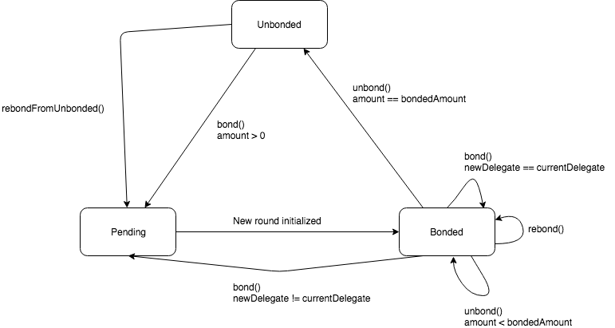
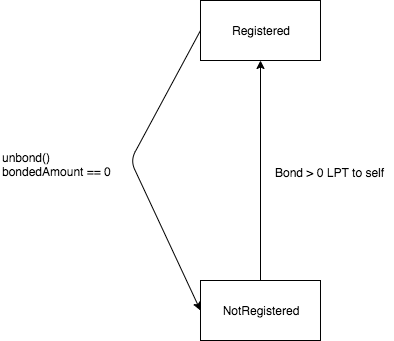
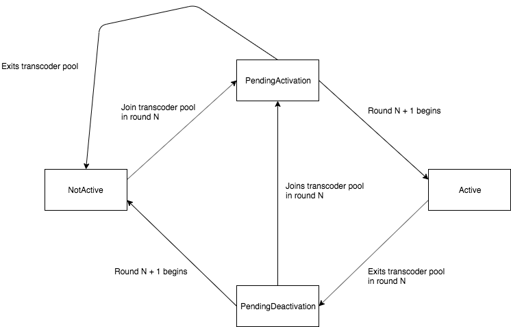

# Livepeer Protocol Technical Specification

## Table of Contents

* [Introduction](#introduction)
* [Users](#users)
* [Mechanics](#mechanics)
* [Smart Contract Design](#smart-contract-design)
* [Data Types](#data-types)
* [Actions](#actions)
* [Parameters](#parameters)

## Introduction

The Livepeer protocol defines the rules of participation for a cryptotoken powered decentralized video transcoding marketplace. The protocol relies on a system of smart contracts deployed on the Ethereum blockchain.

This document is a technical specification of the protocol. For a more general overview of the protocol see:

- The [whitepaper](https://github.com/livepeer/wiki/blob/master/WHITEPAPER.md) for the original proposal
- The [Streamflow proposal paper](https://github.com/livepeer/wiki/blob/master/STREAMFLOW.md) for the Streamflow scalability upgrade proposal

This specification applies to the Streamflow version of the protocol.

This specification will describe protocol actions in terms of smart contract function calls that trigger state transitions within the system.

## Users

Users that bond tokens have **bonded stake** that can be delegated to another user. The total amount of bonded tokens delegated to a user is the user's **delegated stake**.

The users that participate in the Livepeer protocol are:

- **Delegators**: Users that bond tokens and delegate their bonded stake to other users, usually registered transcoders in exchange for shared rewards and fees.
- **Transcoders**: Delegators with bonded stake delegated to themselves that also perform transcoding work for the network. The transcoders with the most delegated stake are elected as active transcoders that process transcode jobs for the network. Note that as of the Streamflow version of the protocol, outside of the contracts and this specification, most documentation will use the term "orchestrator" to refer to the protocol participant that performs transcoding work and will use the term "transcoder" to refer to machines connected to orchestrators that transcode video, but do not directly participate in the protocol. Pre-Streamflow, the transcoder role performed all of these functions. We continue to use the term "transcoder" to refer to the protocol participant that performs transcoding work in the contracts and specification since the distinction between an orchestrator and transcoder is an extra-protocol concern.
- **Broadcasters**: Submit transcode jobs for video streams.

## Mechanics

The Livepeer protocol is round based and each round is represented by some number of Ethereum blocks. During each round, delegators help elect the top transcoders that share the most rewards and fees and the transcoders 
that they believe will create the most economic value in the network by efficiently transcoding video streams. They delegate their bonded stake to registered transcoders and at
the beginning of each round, the top transcoders with the largest amount of delegated stake amongst all registered transcoders are locked in as the members of the active transcoder set for that round.

Active transcoders will:

- Earn inflationary rewards during a round in proportion to their delegated stake. The transcoder keeps a portion of the rewards and shares the rest with its delegators based on the reward cut rate previously advertised
- Earn fees by transcoding video sent by broadcasters. The transcoder keeps a portion of fees earned and shares the rest with is delegators based on the fee share rate previously advertised
- Advertise a URI in an on-chain registry that broadcasters can use to connect with the transcoders off-chain

Broadcasters that seek to distribute video to a large audience in a variety of bitrates and formats it will connect with active transcoders off-chain and send video segments to selected transcoders that will transcode input segments into output segments corresponding to the video profiles requested by the broadcaster.

The broadcaster's workflow consists of the following processes:

- A transcoder selection algorithm based on a combination of factors such as stake, price and historic performance in order to pick transcoders to send segments to
- An off-chain payment protocol to send micropayments to transcoders that can be aggregated into larger macropayments that can be settled on-chain
- An off-chain payment accounting protocol to determine the value of payments to send to transcoders
- A local verification algorithm on results received from a transcoders in order to check that video was correctly transcoded

The only process listed that is currently in the scope of this specification is the off-chain payment protocol. The Streamflow version of the protocol uses a probabilistic micropayment (PM) protocol and design details can be found in the [PM specification](pm.md).

## Smart Contract Design

The Livepeer smart contract system is written in Solidity and will be deployed on the Ethereum blockchain. The system consists of the following contracts:

- `Controller`: Maintains a registry that maps contract identifiers to contract addresses.
- `LivepeerToken`: Manages state and logic for the ERC-20 Livepeer token that is used for bonding. The contract owner can mint new tokens.
- `ManagerProxy`: A proxy contract that maintains state and relies on a target contract to implement state changing logic. It forwards function calls using `delegatecall`
to invoke function logic in a target contract with its own storage context.
- `ServiceRegistry`: Manages transcoder service metadata that is required for the off-chain transcoding workflow.
- `RoundsManager`: Manages state and logic associated with round progression.
- `BondingManager`: Manages state and logic associated with bonding, unbonding, transcoder registration, and claiming rewards and fees.
- `TicketBroker`: Manages state and logic associated with the PM protocol (i.e. tracking funds available for tickets, ticket redemption).
- `Minter`: Manages state and logic associated with the issuance of new tokens. The contract also serves as the escrow for all bonded tokens and all deposited Ether (used to pay for tickets in the PM protocol).

Contracts registered with `Controller` are managers. Managers use the registry maintained by `Controller` to look up the addresses of other managers in the system.

`BondingManager`, `TicketBroker`, and `RoundsManager` are deployed as upgradeable manager proxies. An instance of `ManagerProxy` is deployed for each of these managers and the actual
contracts are deployed as target contracts for the manager proxies. As a result, these managers can be upgraded by deploying new versions of the target contracts while maintaining
state (with some storage layout related restrictions).

After protocol genesis, `Minter` becomes the owner of `LivepeerToken` and is able to issue new tokens based on the logic in its implementation.

For any contract with the name `Contract` we refer to the deployed instance of the contract as `contract`.

Function calls on a specific contract are written as `contract.foo()`. Parameters are excluded when describing function calls and instead detailed in plain English.

The staking token of the protocol is the Livepeer token which will be referred to as LPT.

The payment token of the protocol is currently regular Ether, which will be referred to as ETH, but the protocol could be modified to support other tokens such as stablecoins in the future.

## Data Types

#### Transcoder Pool

In a round, the set of transcoders that are pending activation in the next round is called the transcoder pool. The pool has a max size of `numActiveTranscoders` and is implemented as a sorted doubly linked list. Each element in the pool contains a transcoder's ETH address and the transcoder's delegated stake. At the beginning of a round, the members of the pool are locked in as the active transcoder set for that round.

#### Delegator

Delegator information is stored in a delegator structure. All users that have bonded stake have a delegator structure associated with their address. As a result, users that are transcoders also have
delegator structures stored that contain their bonded stake information.

| Field                   | Description                                                           |
| ----------------------- | --------------------------------------------------------------------- |
| **bondedAmount**        | The amount of bonded stake.                                           |
| **fees**                | The amount of fees collected.                                         |
| **delegateAddress**     | The Ethereum address of the delegate.                                 |
| **delegatedAmount**     | The amount of delegated stake.                                        |
| **startRound**          | The round the delegator becomes bonded and delegated to its delegate. |
| **lastClaimRound**      | The last round that the delegator claimed reward and fee pool shares. |
| **nextUnbondingLockId** | The ID of the next unbonding lock the delegator creates.              |
| **unbondingLocks**      | The collection of unbonding locks created by the delegator.           |

A delegator can have zero or many unbonding locks. See [Unbonding Lock](#unbonding-lock) for more information.

A delegator can be in one of the following states `Pending`, `Bonded`, or `Unbonded`.
- A delegator is in the `Pending` state if `startRound > currentRound`. A delegator enters the `Pending` state when it bonds from the `Unbonded` state.
- A delegator is in the `Bonded` state if `startRound > 0 && startRound <= currentRound`. A delegator enters the `Bonded` state at the start of `startRound` which is set after it bonds.
- A delegator is in the `Unbonded` state if `bondedAmount == 0`. A delegator starts off in the `Unbonded` state by default
and also enters the `Unbonded` state if it fully unbonds.

#### Unbonding Lock

When a delegator unbonds, information about the amount of LPT being unbonded and the round at which the locked LPT can be withdrawn is stored in an unbonding lock structure. 

| Field             | Description                                                                          |
| ----------------- | ------------------------------------------------------------------------------------ |
| **amount**        | The amount of LPT being unbonded                                                     |
| **withdrawRound** | The round at which the unbonding period is over and the locked LPT can be withdrawn. |

#### Transcoder

Transcoder information is stored in a transcoder structure.

| Field                          | Description                                                                         |
| ------------------------------ | ----------------------------------------------------------------------------------- |
| **lastRewardRound**            | The last round that the transcoder called received rewards as an active transcoder. |
| **rewardCut**                  | The percentage of inflationary rewards that a transcoder keeps.                     |
| **feeShare**                   | The percentage of transcode job fees that a transcoder shares with its delegators.  |
| **earningsPoolPerRound**       | The reward and fee pools for each round.                                            |
| **lastActiveStakeUpdateRound** | The last round that the transcoder's stake was updated as an active transcoder.     |
| **activationRound**            | The round in which the transcoder will become active.                               |
| **deactivationRound**          | The round in which the transcoder will become inactive.                             |

A delegator is considered a registered transcoder if it has non-zero bonded stake delegated to itself.

A registered transcoder is considered active if `transcoder.activationRound <= currentRound < transcoder.deacivationRound`.

#### Earnings Pool

Earnings information from a round is stored in an earnings pool structure.

| Field                          | Description                                                                                        |
| ------------------------------ | -------------------------------------------------------------------------------------------------- |
| **rewardPool**                 | Delegator rewards. If `hasTranscoderRewardFeePool = true`, will contain transcoder rewards as well. |
| **feePool**                    | Delegator fees. If `hasTranscoderRewardFeePool = true`, will contain transcoder fees as well.      |
| **totalStake**                 | Transcoder's total stake during the round.                                                         |
| **claimableStake**             | Stake that can be used to claim portions of the delegator reward and fee pools.                    |
| **transcoderRewardCut**        | Transcoder's reward cut for the round.                                                             |
| **transcoderFeeShare**         | Transcoder's fee share for the round.                                                              |
| **transcoderRewardPool**       | Transcoder rewards. If `hasTranscoderRewardFeePool = true`, this will be 0.                        |
| **transcoderFeePool**          | Transcoder fees. If `hasTranscoderRewardFeePool = true`, this will be 0.                           |
| **hasTranscoderRewardFeePool** | Flag to indiciate if delegator and transcoder reward/fee pools are separate.                       |

Note that the `hasTranscoderRewardFeePool` flag was introduced in a previous upgrade. Any earnings pools created prior to the upgrade would not have separate delegator and transcoder reward/fee pools. The `hasTranscoderRewardFeePool` flag is false for these pools (since there was no way to update the flag before the upgrade and since the default value for the storage position for the flag will be false). So, contract code can calculate the amount claimed from reward/fee pools differently depending on if `hasTranscoderRewardFeePool` is true or false. See the comments in the `EarningsPool` library for more details.

#### Record

Transcoder service metadata required for the off-chain transcoding workflow is stored in a record structure.

| Field          | Description                                                                     |
| -------------- | ------------------------------------------------------------------------------- |
| **serviceURI** | The URI endpoint that can be used to send off-chain requests to the transcoder. |

## Actions

This section describes the state transitions associated with common protocol actions.

For actions specific to the PM protocol refer to the [PM specification](pm.md).

### Delegator State Transition Diagram

### Transcoder State Transition Diagram

---

### Round Progression

#### *Requirements*

At the start of each round, the round must be initialized before any other protocol actions can be executed. Round initialization entails
locking in the latest active transcoder set for the round and setting the maximum number of tokens that can be issued (based on the current inflation rate). A round can only be initialized once and anybody can invoke the function to initialize a round.

#### *Initial State*

- `B` is the current block number such that `B % roundLength == 0`

#### *State Affected*

- `RoundsManager`
- `BondingManager`
- `Minter`

#### *Algorithm*

1. At some block number `M` in the set `B, B+1, B+2...B + roundLength - 1`, a user calls `roundsManager.initializeRound()`.
2. `currentRound = M / roundLength`.
3. If the last initialized round is not less than `currentRound`, abort.
4. Set the last initialized round to `currentRound`.
5. Set the total active stake for `currentRound`.
6. Set the maximum number of LPT that can be issued in the round based on the current LPT supply and the current `inflationRate`.

#### *Notes*

Round progression is dependent on some actor calling `roundsManager.initializeRound()` at the start of a new round. Since, protocol actions cannot be executed until
the current round is initialized, actors have an incentive to pay the transaction fees for calling `roundsManager.initializeRound()` if they stand to economically benefit from
any protocol action that could take place during an initialized round. One example is a transcoder that has accumulated enough delegated stake to become an active transcoder in a round. The
transcoder will be able to claim inflationary rewards and fees from processing transcode jobs if it joins the active transcoder set for a round, so it has an incentive to initialize a round so that
it can be included in the active transcoder set for that round.

---

### Bonding

#### *Requirements*

Delegators bond LPT and delegate their bonded stake either to themselves or to someone else. Although delegators do not have to delegate to registered transcoders, they are incentivized to do so
by the potential returns in the inflationary rewards and fees shared by the transcoder. Delegators cannot bond more tokens than they own.

#### *Initial State*

- User `T`
- User `D`

#### *State Affected*

- `LivepeerToken`
- `BondingManager`

#### *Algorithm*

1. `D` approves `bondingManager` to transfer an amount of LPT from `D` by calling `livepeerToken.approve()`.
2. `D` calls `bondingManager.bond()` to bond `X` LPT to `T`.
3. [Increase T's total stake by X](#increasing-total-stake)
4. `D`'s LPT balance decreases by `X`.
5. `D` is delegated to `T`.
6. Set `startRound = currentRound + 1`.
7. `D` enters the `Pending` state.
8. Once `currentRound = startRound`, `D` enters the `Bonded` state.

---

### Changing Delegate

#### *Requirements*

Delegators that delegated their bonded stake to a transcoder can delegate their bonded stake to someone else. Reward and fee shares from past rounds will
automatically be claimed first - see [Automatically Claiming Rewards and Fees](#automatically-claiming-rewards-and-fees) for more details.

#### *Initial State*

- Users `T1`, `T2`
- User `D` delegated to `T1`
- User `D` in the `Bonded` state

#### *State Affected*

- `BondingManager`

#### *Algorithm*

1. `D` calls `bondingManager.bond()` to bond 0 LPT to `T2`.
2. `D`'s bonded stake `X` becomes delegated to `T2`.
3. [Decrease T1's total stake by X](#decreasing-total-stake)
4. [Increase T2's total stake by X](#increasing-total-stake)

---

### Changing Delegate and Increasing Bonded Stake

#### *Requirements*

Delegators that delegated their bonded stake to someone can atomically delegate their bonded stake to someone else and also increase
their bonded stake. Reward and fee shares from past rounds will
automatically be claimed first - see [Automatically Claiming Rewards and Fees](#automatically-claiming-rewards-and-fees) for more details.

#### *Initial State*

- Users `T1` and `T2`
- User `D` is delegated to `T1`
- User `D` in the `Bonded` state

#### *State Affected*

- `LivepeerToken`
- `BondingManager`

#### *Algorithm*

1. `D` approves `bondingManager` to transfer `X2` LPT from `D` by calling `livepeerToken.approve()`.
2. `D` calls `bondingManager.bond()` to bond `X2` LPT to `T2`.
3. `D`'s bonded stake increases to `X1 + X2`.
4. [Decrease T1's total stake by X1](#decreasing-total-stake)
5. [Increase T2's total stake by X1 + X2](#increasing-total-stake)
6. `D`'s LPT balance decreases by `X2`.

---

### Increasing Total Stake

#### *Requirements*

When delegators delegate their bonded stake to a delegate, they increase the delegate's total stake.

#### *Initial State*

- User `T`
- User `D`

#### *State Affected*

- `BondingManager`

#### *Algorithm*

1. Increase `T`'s delegated amount by `X`
2. If `T` is not a registered transcoder, return
3. If `T` is not in the transcoder pool, [try to add it to the transcoder pool](#joining-the-transcoder-pool) and return
4. Update `T`'s position in the transcoder pool
5. Add `X` to the next round's total active stake
6. Increase `totalStake` and `claimableStake` for `T`'s earnings pool for the next round by `X`
7. Set `T`'s `lastActiveStakeUpdateRound = nextRound`

---

### Decreasing Total Stake

#### *Requirements*

When delegators unbond or change their delegation, they increase their current delegate's total stake. 

#### *Initial State*

- User `T`
- User `D`

#### *State Affected*

- `BondingManager`

#### *Algorithm*

1. Decrease `T`'s delegated amount by `X`
2. If `T` is not in the transcoder pool, return
3. Update `T`'s position in the transcoder pool
4. Subtract `X` from the next round's total active stake
5. Decrease `totalStake` and `claimableStake` for `T`'s earnings pool for the next round by `X`
6. Set `T`'s `lastActiveStakeUpdateRound = nextRound` 

---

### Joining The Transcoder Pool

#### *Requirements*

A registered transcoder can join the transcoder pool if it has sufficient total stake.

#### *Initial State*

- Registered transcoder `T` with total stake `X`

#### *State Affected*

- `BondingManager`

#### *Algorithm*

1. If the transcoder pool is full:
   1. Let `lastTranscoder` be the transcoder in the pool with the smallest stake. Let `lastStake` be the stake of `lastTranscoder`
   2. If `X <= lastStake`, return
   3. [Deactivate lastTranscoder](#deactivating-a-transcoder)
2. Add `T` to the transcoder pool
3. Add `X` to the next round's total active stake
4. Set `totalStake` and `claimableStake` for `T`'s earnings pool for the next round to `X`
5. Set `T`'s `lastActiveStakeUpdateRound = nextRound`
6. Set `T`'s `activationRound = nextRound`
7. Set `T`'s `deactivationRound = MAX_FUTURE_ROUND`

`MAX_FUTURE_ROUND` is a very large integer (i.e. `2^256 - 1`) representing a round very far in the future.

---

### Deactivating A Transcoder 

#### *Requirements*

A transcoder will be pending deactivation if:

- It fully unbonds
- Is evicted from the transcoder pool because another transcoder joined with more total stake

#### *Initial State*

- Active transcoder `T` with total stake `X`

#### *Algorithm*

1. Remove `T` from the transcoder pool 
2. Subtract `X` from the next round's total active stake
3. Set `T`'s `deactivationRound = nextRound`

---

### Unbonding

#### *Requirements*

Delegators can unbond some or all of their bonded stake. When a delegator unbonds the LPT becomes locked in an unbonding lock. Locked LPT can be withdrawn after an unbonding period or rebonded at anytime. Reward and fee shares from past rounds will automatically be claimed first - see [Automatically Claiming Rewards and Fees](#automatically-claiming-rewards-and-fees) for more details.

#### *Initial State*

- User `D` is delegated to `T`
- User `D` in the `Bonded` state

#### *State Affected*

- `BondingManager`

#### *Algorithm*

1. `D` calls `bondingManager.unbond()` to unbond `X` from `T`.
2. If `D` is not in the `Bonded` state, abort.
3. If `X` is greater than `D`'s current bonded stake, abort.
4. Create an unbonding lock for `D` with the ID `nextUnbondingLockId`. Set `amount` to `X` and `withdrawRound` to `currentRound + unbondingPeriod`.
5. Increment `nextUnbondingLockId`.
6. `D`'s bonded stake decreases by `X`.
7. If `D`'s bonded stake is zero, remove its delegate and start round.
8. If `D` is in the transcoder pool, [deactivate D](#deactivating-a-transcoder)
9. [Decrease T's total stake by X](#decreasing-total-stake)

---

### Rebonding While Bonded

#### *Requirements*

Delegators can unbond some or all of their bonded stake and then rebond the LPT. The delegator does not have to wait for the unbonding period for locked LPT to complete before rebonding. If the delegator is in the `Bonded` state, locked LPT can only be rebonded to the delegator's current delegate. Reward and fee shares from past rounds will automatically be claimed first - see [Automatically Claiming Rewards and Fees](#automatically-claiming-rewards-and-fees) for more details.

#### *Initial State*

- User `D` is delegated to `T`
- User `D` in the `Bonded` state
- User `D` previously executed the `Unbonding` algorithm. Let the fields for the relevant unbonding lock for rebonding be `unbondingLockId`, `amount` and `withdrawRound`

#### *State Affected*

- `BondingManager`

#### *Algorithm*

1. `D` calls `bondingManager.rebond()`  with `unbondingLockId`.
2. If `D` is in the `Unbonded` state, abort.
3. If `unbondingLockId` is not a valid unbonding lock ID, abort.
4. `D`'s bonded stake increases by `amount`.
5. [Increase T's total stake by amount](#increasing-total-stake)
6. Delete the unbonding lock for `unbondingLockId`.

---

### Rebonding While Unbonded

#### *Requirements*

Delegators can unbond some or all of their bonded stake and then rebond the LPT. Delegators can be in the `Unbonded` state and rebond locked LPT to a delegate of their choice. Reward and fee shares from past rounds will automatically be claimed first - see [Automatically Claiming Rewards and Fees](#automatically-claiming-rewards-and-fees) for more details.

#### *Initial State*

- User `D` is in the `Unbonded` state
- User `D` previously executed the `Unbonding` algorithm. Let the fields for the relevent unbonding lock for rebonding be `unbondingLockId`, `amount` and `withdrawRound`

#### *State Affected*

- `BondingManager`

#### *Algorithm*

1. `D` calls `bondingManager.rebondFromUnbonded()` with the new delegate `T` and `unbondingLockId`.
2. If `D` is not in the `Unbonded` state, abort.
3. If `unbondingLockId` is not a valid unbonding lock ID, abort.
4. `D`'s start round is set to `currentRound + 1`.
5. `D`'s delegate is set to `T`.
6. `D`'s bonded stake increases by `amount`.
7. [Increase T's total stake by amount](#increasing-total-stake)
8. Delete the unbonding lock for `unbondingLockId`.

---

### Withdrawing Bonded Stake (LPT)

#### *Requirements*

Delegators with bonded stake can unbond to start the process of withdrawing their bonded LPT. Delegators cannot withdraw locked LPT until the unbonding period for the locked LPT is complete. Reward and fee shares from past rounds will automatically be claimed first - see [Automatically Claiming Rewards and Fees](#automatically-claiming-rewards-and-fees) for more details.

#### *Initial State*

- User `D` previously executed the `Unbonding` algorithm. Let the fields for the relevent unbonding lock for rebonding be `unbondingLockId`, `amount` and `withdrawRound`
- The protocol progressed through `unbondingPeriod` number of rounds such that the current round is `withdrawRound`.

#### *State Affected*

- `LivepeerToken`
- `BondingManager`

#### *Algorithm*

1. `D` calls `bondingManager.withdrawStake()` with `unbondingLockId`.
2. If `unbondingLockId` is not a valid unbonding lock ID, abort.
3. If `withdrawRound > currentRound`, abort.
4. `D`'s LPT balance increases by `amount`.
5. Delete the unbonding lock for `unbondingLockId`.

---

### Withdrawing Fees (ETH)

#### *Requirements*

Delegators can withdraw any collected fees at any time. Reward and fee shares from past rounds will
automatically be claimed first - see [Automatically Claiming Rewards and Fees](#automatically-claiming-rewards-and-fees) for more details.

#### *State Affected*

- `BondingManager`

#### *Initial State*

- User `D`

#### *Algorithm*

1. `D` calls `bondingManager.withdrawFees()` to withdraw `X` ETH.
2. `D`'s collected fees decreases by `X`.
3. `D`'s ETH balance increases by `X`.

---

### Transcoder Registration

#### Requirements

A user can register as a transcoder by delegating > 0 LPT to itself.

#### Initial State

- User `T` that is not registered

#### State Affected

- `BondingManager`

#### Algorithm

1. `T` calls `bondingManager.bond()` with delegate `T` and `X > 0`

---

### Transcoder Service URI Update

#### Requirements

A transcoder can update its service URI in the `ServiceRegistry` to be used in the off-chain transcoding workflow.

#### Initial State

- User `T`

#### State Affected

- `ServiceRegistry`

#### Algorithm

1. `T` calls `serviceRegistry.setServiceURI()` with a provided `serviceURI`.
2. `T`'s service URI in `ServiceRegistry` is set to `serviceURI`.

---

### Transcoder Update

#### *Requirements*

A transcoder can change its commission rates (i.e. reward cut and fee share) during a round. A transcoder cannot change its rates during the lock period of a round. A transcoder can also try to join the transcoder pool if it has sufficient stake in the same transaction that it updateds its commission rates.

#### *Initial State*

- Transcoder `T`

#### *State Affected*

- `BondingManager`

#### *Algorithm*

1. `T` calls `bondingManager.transcoder()` with percentage values for `rewardCut` and `feeShare`.
2. If `rewardCut` is not a valid percentage, abort.
3. If `feeShare` is not a valid percenage, abort.
4. If `T` is not a registered transcoder, abort.
5. If the protocol is in the lock period of the round, abort.
6. If `T` is active in the current round and `lastRewardRound != currentRound`, abort.
7. Set the rates for `T` as a transcoder.
8. If `T` is not in the transcoder pool, [try to add T to the transcoder pool](#joining-pending-active-set)

Note: Step 6 ensures that if `T` is active in the current round that it is unable to change its `rewardCut` and `feeShare` before locking the current values as the `transcoderRewardCut` and `transcoderFeeShare` values in `T`'s earnings pool for the round (these values recorded in the earnings pool are used to calculate distribution of rewards/fees between a transcoder and its delegators for the round). A non-active transcoder would be able to freely set its `rewardCut` and `feeShare` which should be ok because 1) a non-active transcoder will not be eligible for inflationary rewards so it will not have rewards to share and 2) broadcasters will only be working with active transcoders so a non-active transcoder will not have fees to share.

---

### Rewards

#### *Requirements*

LPT rewards are distributed every round to the members of the active transcoder set for the round. The total rewards available for a round is based on newly issued LPT from inflation.
The amount of issued LPT during a round cannot exceed the maximum amount of LPT to be issued for a round which is set at the start of a round. An active transcoder's share of the rewards is based on the transcoder's proportional
delegated stake within the active transcoder set.

#### *Initial State*

- Total delegated stake of the active transcoder set is `X`
- Active transcoder `T` has `Y` delegated stake
- Maximum amount of LPT to be issued in round `N` is `A`.

#### *State Affected*

- `BondingManager`
- `Minter`
- `LivepeerToken`

#### *Algorithm*

1. `T` calls `bondingManager.reward()` in round `N`.
2. Set `T`'s `lastRewardRound = currentRound`
3. Set the commission rates on `T`'s earnings pool for `currentRound` using its current `rewardCut` and `feeShare`
4. `(A * Y) / X` new LPT is issued.
5. Total supply of LPT increased by `(A * Y) / X`.
6. Increase amount of LPT already issued in round `N` by `(A * Y) / X`.
7. `T` places `(A * Y) / X` LPT in its reward pool for round `N`.

#### *Notes*

A delegator is not credited with its reward shares until it explicitly claims them. Thus, the total reward shares to be claimed added to a delegator's bonded stake is the
delegator's `pendingStake`. If a delegator has claimed all of its reward shares, its bonded stake will be equal to its `pendingStake`.

---

### Claiming Rewards & Fees

#### *Requirements*

Delegators that delegate their bonded stake to an active transcoder are entitled to a portion of the rewards and fees that the transcoder earns during a round. The reward and fee portions shared
by the transcoder to its delegators are based on the `rewardCut` and `feeShare` rates set by a transcoder. When a transcoder earns rewards during a round, it places the LPT in a reward pool associated
with the round. When a transcoder earns fees for a transcode job, it places the ETH in a fee pool associated with the round during which the transcode job was created.
The delegator reward share for a round is split amongst delegators that were delegated to the transcoder during the round based on a delegator's proportional bonded stake relative to the transcoder's delegated
stake. The transcoder is entitled to `rewardCut` percent of the reward pool. The delegator fee share for a round is split amongst delegators that were delegated to the transcoder during the round a transcode job was created based
on a delegator's proportional bonded stake relative to the transcoder's delegated stake. The transcoder is entitled to `100 - feeShare` percent of the fee pool.

#### *Initial State*

- Transcoder `T` with `X` delegated stake
- Delegator `D` with `Y` bonded stake delegated to `T`

#### *State Affected*

- `BondingManager`

#### *Algorithm*

1. `T` earns `R` rewards and `F` fees for a transcode job created in round `N`.
2. `T` allocates `delegatorsRewards = (R * (100 - rewardCut)) / 100` rewards for its delegators and `delegatorsFees = (F * feeShare) / 100` for its delegators.
3. `D` claims reward and fees for round `N` either automatically or manually.
2. `D` credits `(delegatorsRewards * X) / Y` rewards into its bonded stake.
3. `D` credits `(delegatorsFees * X) / Y` fees into its collected fees.
4. If `D == T`, `D` also credits `R - delegatorsRewards` rewards into its bonded stake and `F - delegatorsFees` into its collected fees.

#### *Notes*

See [Automatically Claiming Rewards and Fees](#automatically-claiming-rewards-and-fees) and [Manually Claiming Rewards and Fees](#manually-claiming-rewards-and-fees) for details on different approaches to
claiming rewards and fees for particular rounds.

---

### Automatically Claiming Rewards and Fees

#### *Requirements*

When a delegator calls a bonding related function (ex. delegates to a new transcoder), it first automatically claims its LPT share from the reward and fee pools for each round that it was delegated to its current transcoder.

#### *Initial State*

- Delegator `D`
- Transcoder `T`

#### *State Affected*

- `BondingManager`

#### *Algorithm*

1. `D` calls a bonding related function such as `bondingManager.bond()` or `bondingManager.unbond()`.
2. Before the logic of the bonding related function is executed, `D` claims rewards and fees for each round it was delegated to its current delegate through the current round.
3. After claiming rewards and fees through the current round, `D` sets its last claim round as the current round.
4. Execute the logic of the bonding related function.

#### *Notes*

If a delegator does not invoke a bonding related functions for a large number of rounds, it is possible that the number of rounds that it would need to automatically claim rewards and fees for becomes too large such
that the bonding related function cannot be executed within the Ethereum block gas limit. A restriction is imposed such that a delegator cannot claim through more rounds than
`maxEarningsClaimsRounds`. In this situation, a delegator can manually claim rewards and fees through a chosen end round.

---

### Manually Claiming Rewards and Fees

#### *Requirements*

Delegators can automatically claim rewards and fees when calling bonding related functions, but they need to be able to manually claim rewards and fees as well. A delegator can claim rewards and fees from its
last claim round through a chosen end round which does not necessarily have to be the current round.

#### *Initial State*

- Delegator `D`
- Transcoder `T`

#### *State Affected*

- `BondingManager`

#### *Algorithm*

1. `D` calls `bondingManager.claimEarnings()` with the end round through which to claim rewards and fees.
2. `D` claims rewards and fees for each it was delegated to its current delegate through the end round.
3. `D` sets its last claim round as the chosen end round.

#### *Notes*

A client interacting with the protocol can check how many rounds a delegator would have to claim rewards and fees for before calling a bonding related function. If the number of rounds is too large,
the client can divide the number of rounds into portions and make multiple calls to `bondingManager.claimEarnings()` with the end rounds corresponding to each portion. After claiming all the rewards
and fees, the client can then call the bonding related function without the risk of a function call not being executable within the Ethereum block gas limit. A restriction is imposed such that
a delegator cannot claim through more rounds than `maxEarningsClaimsRounds`.

---

### Manager Proxy Upgrades

#### *Requirements*

The only user that is able to upgrade a manager is the owner of `Controller`. Upgrading a manager proxy entails deploying a new version of the target contract that the manager proxy
depends on. The new version of the target contract can contain arbitrary changes in the business logic of the old version of the target contract. The new version of the target contract should
not change the storage layout of the old version of the target contract, meaning the definition order of existing storage variables should not change and existing storage variables should not be
removed or replaced. However, the names of existing storage variables can be changed and new storage variables can be added in the new version of the target contract.

#### *Initial State*

- `proxyName` is the name of the manager proxy being upgraded
- `proxyId` is the contract ID of the manager proxy, defined as `keccak256(proxyName)`
- `targetName` is the name of the target contract, conventionally defined as `proxyName + "Target"`
- `targetId` is the contract ID of the target contract, defined as `keccak256(targetName)`
- `newTargetAddr` is the address of the new version of the target contract

#### *State Affected*

- `Controller`

#### *Algorithm*

1. `controller`'s owner calls `controller.setContract(targetId, newTargetAddr)`
2. `controller` sets the contract address mapped to `targetId` as `newTargetAddr`
3. The manager proxy with ID `proxyId` uses `delegatecall` to forward function calls to the target contract with ID `targetId` and address `newTargetAddr`.

---

### Updating Parameters

#### *Requirements*

The only user that is able to update a manager's parameter values is the owner of `Controller`.

#### *Initial State*

- `paramName` is the name of the parameter being updated
- `newValue` is the new value for the parameter `paramName`

#### *State Affected*

- The manager

#### *Algorithm*

1. `controller`'s owner calls the parameter setter function defined in `manager` for `paramName`. For example, if `paramName == "unbondingPeriod"`, the function call is `manager.setUnbondingPeriod(newValue)`.
2. `manager` sets the value for `paramName` as `newValue`
3. `manager` fires an event notifying clients of the parameter update.

---

### Inflation Adjustment

#### *Requirements*

`inflation` automatically adjusts based upon the current bonding rate, the total amount of active bonded stake (i.e. the total stake of the active transcoder set) in the network relative to the total supply of LPT, and `targetBondingRate`.
If the current bonding rate is below `targetBondingRate`, `inflation` should increase. The desired effect of an increase in `inflation` is for more users to participate in the
bonding and delegation process in order to increase the economic security of the network. Users that bond will be able to capture a larger share of the network relative to users that do
not bond by claiming a share of the inflationary rewards every round. Users that do not bond will see their LPT holdings become diluted in value due to the increase in the supply of LPT.
If the current bonding rate is above `targetBondingRate` `inflation` should decrease. The desired effect of a decrease in `inflation` is for less users to participate in the
bonding and delegation process in order to increase the amount of liquid LPT available in the network. Since the inflationary rewards are smaller, users might prefer to hold on to
liquid unbonded LPT which can be freely transacted and traded rather than bonding which locks up the LPT for a period of time. If the current bonding rate is equal to `targetBondingRate`,
`inflation` is unchanged.

#### *Initial State*

- Transcoder `T`
- Delegator `D`

#### *State Affected*

- `BondingManager`
- `RoundsManager`
- `Minter`

#### *Algorithm*

1. The current bonding rate increases via a call to a bonding related function in `BondingManager`.
2. A new round begins and someone calls `roundsManager.initializeRound()` to initialize the round.
3. If the current bonding rate is less than `targetBondingRate`, increase `inflation` by `inflationChange`.
4. If the current bonding rate is greater than `targetBondingRate`, decrease `inflation` by `inflationChange`.
5. If the current bonding rate is equal to `targetBondingRate`, keep `inflation` the same.

## Parameters

The protocol uses a number of parameters the values of which are used in protocol actions. In initial development phases after genesis, the values of these parameters can
be changed by the `Controller`'s owner which will be a multisig contract. In later development phases, the values of these parameters will only be changed by governance.

Each of the parameters are defined in the manager that they are the most relevant for.

### RoundsManager

| Parameter         | Description                                                                                                                                                        | Example Value |
| ----------------- | ------------------------------------------------------------------------------------------------------------------------------------------------------------------ | ------------- |
| `roundLength`     | Number of blocks in a round.                                                                                                                                       | 5760          |
| `roundLockAmount` | Percentage of blocks in a round that are a part of the lock period during which transcoders cannot change their rates upwards, or enter/leave the transcoder pool. | 10            |

### BondingManager

| Parameter                 | Description                                                                                                    | Example Value |
| ------------------------- | -------------------------------------------------------------------------------------------------------------- | ------------- |
| `unbondingPeriod`         | Number of rounds that a delegator must wait after calling `unbond` before it can withdraw its unbonded LPT.    | 7             |
| `numActivetranscoders`    | Maximum number of active transcoders during a round.                                                           | 10            |
| `maxEarningsClaimsRounds` | Maximum number of past rounds that a delegator can claim reward and fee shares through in a single transaction | 20            |

### Minter

| Parameter           | Description                                                                                                  | Example Value |
| ------------------- | ------------------------------------------------------------------------------------------------------------ | ------------- |
| `inflation`         | Percentage of total LPT supply that is issued as new LPT during a round.                                     | 7             |
| `inflationChange`   | Percentage change in inflation that occurs when the current bonding rate does not equal `targetBondingRate`. | .02           |
| `targetBondingRate` | Percentage of total LPT supply that should be bonded to provid economic security for the system.             | 50            |

For `TicketBroker` parameters refer to the [PM specfication](pm.md).